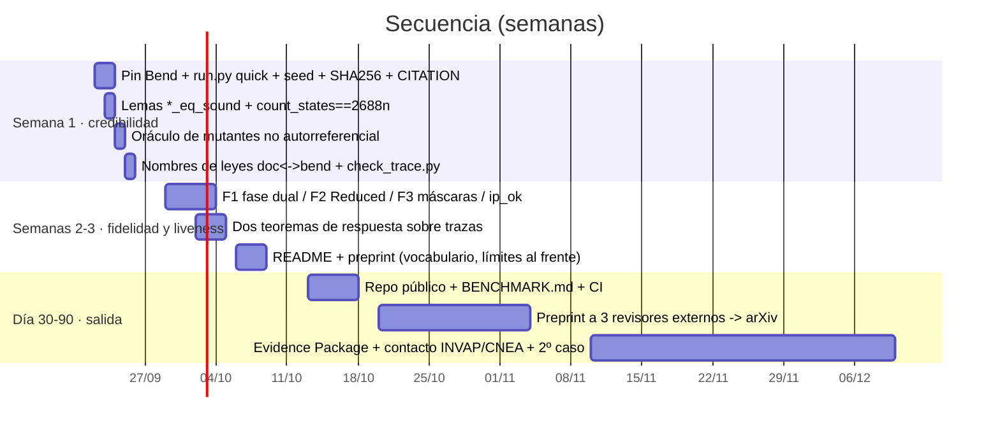
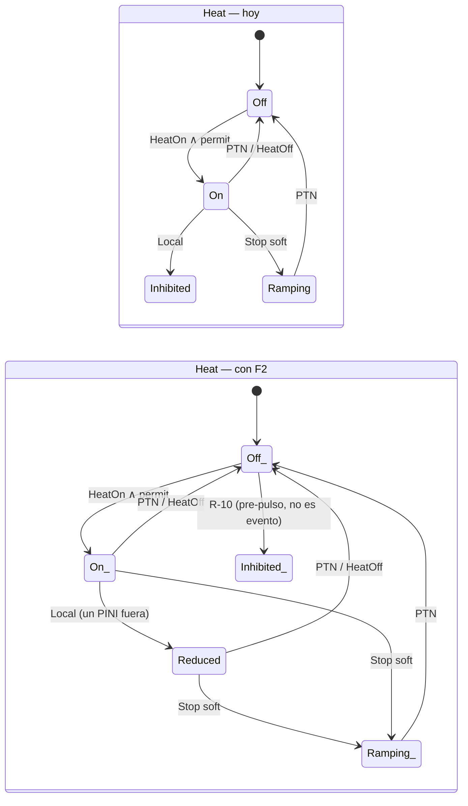
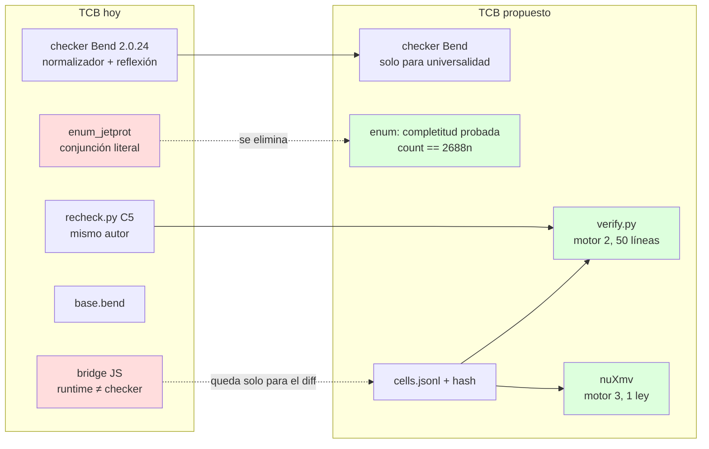
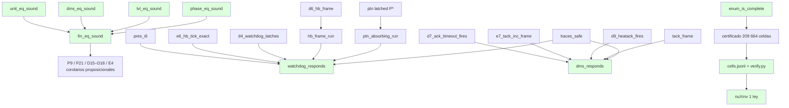
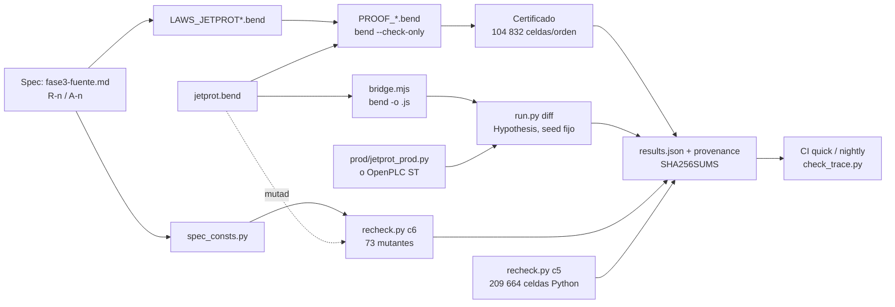
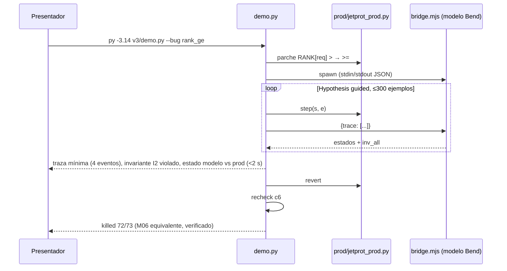
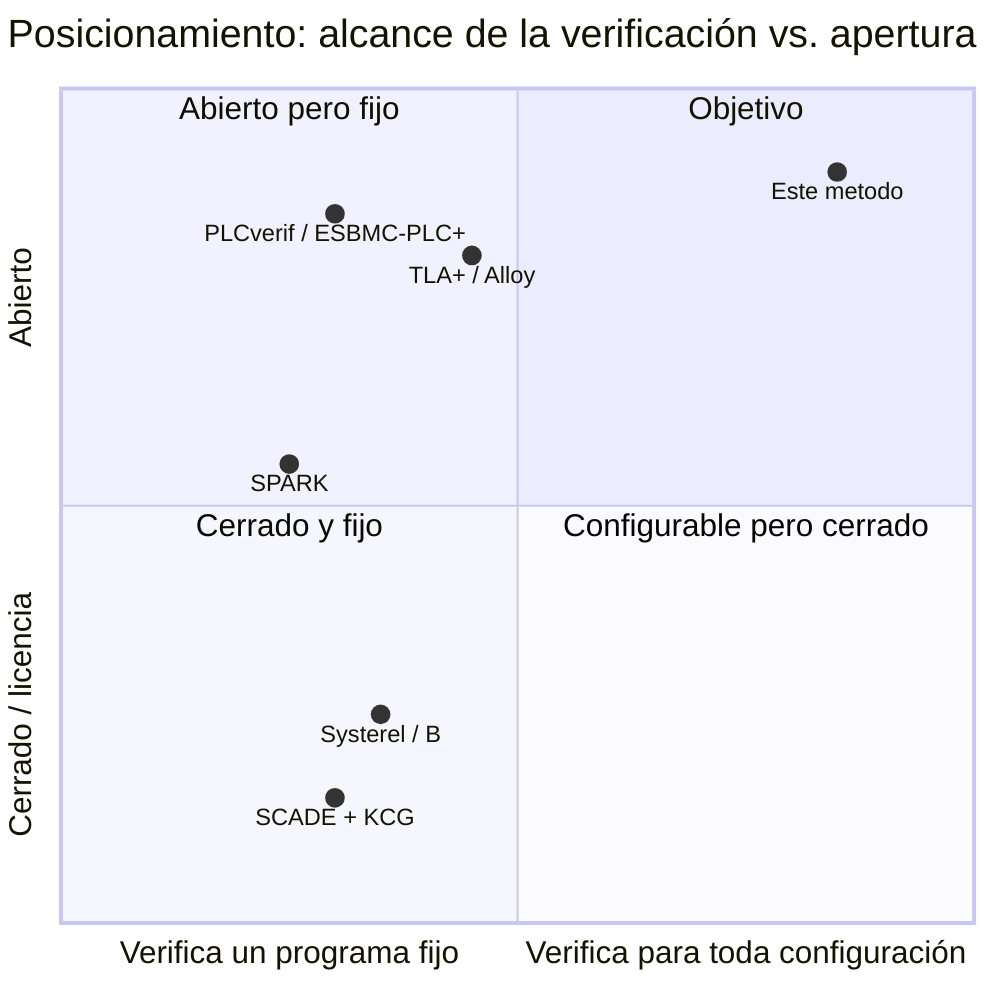
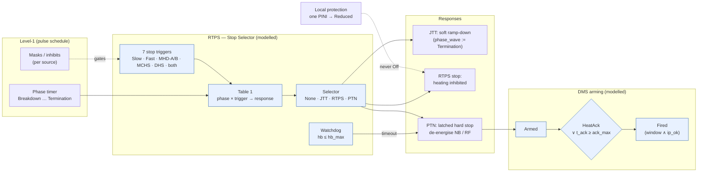
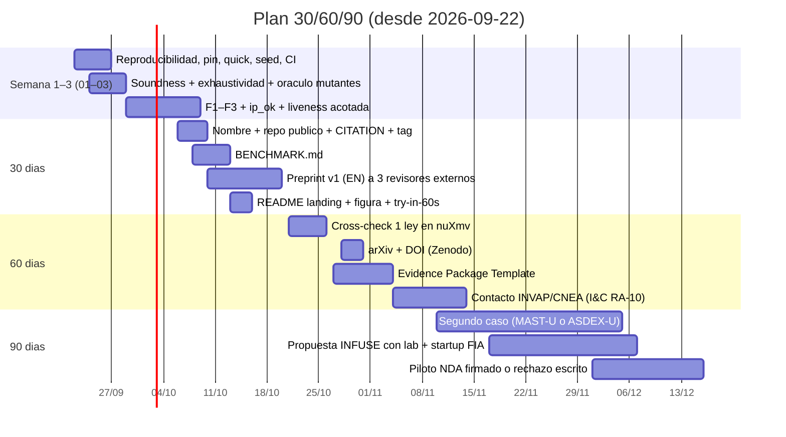

# Plan de mejoras — bend-spike / caso JET (2026-09-21)

Resultado de una auditoría con seis revisores independientes por perspectiva (fidelidad a [S1]/[S2]/[S6],
métodos formales, testing diferencial, seguridad funcional IEC 61508/61513, mercado, docs/reproducibilidad)
y cuatro diseñadores. Los 19 `PROOF*.bend` pasan en Bend **2.0.24** (re-chequeado hoy; el pin del repo sigue en 2.0.6).

## Veredicto

El **método** (leyes → certificado por cómputo + reflexión → testing diferencial contra la implementación) es sólido y
honesto en sus límites. El **caso** promete más de lo que entrega en dos frentes: fidelidad a JET (tres discrepancias
que un autor de [S1] objetaría) y reproducibilidad (un desconocido no reproduce en una hora). El activo vendible es
el método —*pruebas que no crecen con la configuración*—, no el caso JET ni Bend.

## Hallazgos que cambian el plan

| Área | Hallazgo | Sección |
|---|---|---|
| Fidelidad | JTT re-etiqueta la fase y `concretize` lee la fila `Termination`; protección local apaga el sistema entero (R-9 dice *un PINI*); CommFault/ciegas incondicionales (fuente: "*can* trigger", máscaras Level-1) | 01 |
| Formal | Sin lemas `*_eq_sound` (vector de vacuidad barato); sin liveness acotada sobre trazas; exhaustividad de la enumeración no probada; `step_c_is_the_concrete_step` es `{==}` | 02 |
| Testing | Banco de mutantes autorreferencial (5/6 mutantes de constantes sobreviven); Hypothesis sin seed; `results.json` fuera del repo | 03 |
| Repro | `env/bend.sh` no pinea commit; `env/check_env.sh:27` usa `bend --version` (eliminado en 2.0.17: hoy falla en entorno limpio; es `bend version`); `run.py --help` lanza el gate de 6 min; sin `requirements`/`CITATION`/CI; 32/64 leyes con otro nombre en docs | 03 |
| Mercado | Ángulo único: verificación por configuración; puertas: labs I&C, startups DOE/NRC-fusión (INFUSE vía lab), INVAP/CNEA RA-10; artefacto: `BENCHMARK.md` + preprint cs.SE + Evidence Package | 04 |

## Orden de ejecución



Regla de vocabulario para todo lo que se publique: *decidido por cómputo y elevado por reflexión* ≠ verificación
independiente; el caso JET es retrospectivo (máquina cerrada en 2023) y se presenta como el único dataset de
protección de máquina con V&V publicada.


---

# 01 — Fidelidad a [S1]/[S2]/[S6]: diseño de F1, F2, F3 e `ip_ok`

Fecha: 2026-09-21. Estado: **diseño, no implementado**. Origen: auditoría de fidelidad (agente físico de
operaciones) sobre `v3/jetprot.bend` rev. actual. Bend 2.0.24: cada operador lleva su propio `( .. : T)`;
un `let` tipado se escribe `x : T = v`. Nombres de defs y leyes son los reales del `.bend`.

Resumen: el modelo transcribe bien la Tabla 1 y la secuencia DMS, pero en tres puntos afirma una política
**distinta** de la publicada sin declararla, y omite el único veredicto barato que cubre 7/16 disrupciones
perdidas de R-15. Las cuatro correcciones son locales (tipos + 4 defs + 9 leyes), el certificado crece
de 2 688 a **21 504** estados (×8), dentro de lo que el patrón seq3 ya soporta (209 664 celdas en C5).

---

## F1 — JTT no contamina la fila de la Tabla 1

**Problema.** `soft_apply` llama a `jtt_phase(req, p)` y escribe `Termination{}` en `Fin.phase`. Desde
entonces `concretize(i, p, XAlarm{t})` consulta `table(i, Termination, t)`: un `Slow` o `Mchs` posterior
en una descarga que estaba en Heating 2 mapea a PTN y (A-1: JTT < PTN) escala a parada dura. [S2] §3.4
describe exactamente esta trampa ("two views of time"): en JET la fase de la Tabla 1 es la **fase
temporizada de Level-1**, no la del waveform de terminación que el JTT dispara. Hoy el efecto no está
declarado en ninguna A-n.

**(a) Tipos.** `Fin` pasa a llevar dos fases; la tabla lee `prog`, el permisivo y la ventana DMS leen `wave`.

```bend
# fase de programa (Level-1, la que indexa la Tabla 1) y fase de onda (la que el JTT salta)
type Fin is Data:
  Fin{prog: Phase, wave: Phase, level: Level, dms: Dms, plasma: Bool, nb: Heat, rf: Heat}

def jtt_phase(req: Level, p: Phase) -> Phase:      # sin cambios: actúa sobre wave
  match req:
    case LJtt{}:
      Termination{}
    case _:
      p

def soft_apply(+req: Level, f: Fin) -> Fin:
  match f:
    case Fin{pg, pw, l, d, pl, nb, rf}:
      Fin{pg, jtt_phase(req, pw), req, d, pl, ramp(nb), ramp(rf)}

def concretize(i: Inst, f: Fin, c: CEv) -> Ev:       # recibe el Fin, no una Phase
  match c:
    case XAlarm{t}:
      +t2 = t
      +pg = prog_of(f)
      Stop{table(i, pg, t2), dms_req(dms_phase_of(f), t2)}
    ...
```

`Advance` avanza **ambas** (`prog` y `wave` en lockstep hasta que el JTT las separa); `wave` nunca
retrocede; `prog` sigue el reloj de Level-1 aunque el JTT haya saltado.

**(b) Leyes.**

```bend
# F1a: la fila de la tabla que usa un evento concreto es la fase de programa, nunca la de onda
law f1_table_reads_prog:
  for +i: S.Inst
  for +f: S.Fin
  for +t: S.Trig
  {S.stop_req_of(S.concretize(i, f, S.XAlarm{t})) == S.table(i, S.prog_of(f), t) : S.Level}

# F1b: un stop suave no mueve la fase de programa
law f1_soft_keeps_prog:
  for +o: S.Ord
  for +f: S.Fin
  for +req: S.Level
  {S.prog_of(S.soft_if(S.lvl_lt(o, S.level_of(f), req), req, f)) == S.prog_of(f) : S.Phase}

# F1c: wave >= prog siempre (invariante nuevo I7, va dentro de inv_fin)
law f1_wave_ahead:
  for +f: S.Fin
  for +h: {S.inv_fin(f) == True{} : Bool}
  {S.phase_le(S.prog_of(f), S.wave_of(f)) == True{} : Bool}
```

**(c) Certificado.** `wave` toma valores ≥ `prog`: 28 pares en vez de 7 fases → 2 688 × 4 = **10 752**
estados (no ×7, por I7).

**(d) Registro.** Nueva **A-24**: "la Tabla 1 se indexa por la fase de Level-1; el JTT mueve solo la
fase de onda ([S2] §3.4)". A-5 (orden total de fases) queda solo para `prog`. Ninguna A-n se retira.

```mermaid
flowchart LR
  subgraph antes["Hoy"]
    A1[Heating2] -->|JTT| A2[phase := Termination]
    A2 -->|Slow| A3["table(Termination, Slow) = PTN"]
    A3 --> A4[PTN: parada dura no publicada]
  end
  subgraph despues["Con F1"]
    B1["prog=Heating2 / wave=Heating2"] -->|JTT| B2["prog=Heating2 / wave=Termination"]
    B2 -->|Slow| B3["table(prog=Heating2, Slow) = JTT"]
    B3 --> B4[sigue el JTT: como [S1] Tabla 1]
  end
```

---

## F2 — Protección local reduce, no apaga

**Problema.** `local_fin` pone la unidad en `Inhibited{}` para el resto del pulso. R-9 ([S1] p.1295
"Local Protection"): se apaga *un PINI* "without the NB system as a whole having to stop delivering
power". El modelo hace lo contrario del concepto que el paper introduce.

**(a) Tipos.**

```bend
type Heat is Data:
  Off{}
  Inhibited{}      # se conserva para la vía R-10 (deshabilitado pre-pulso), ya no la usa Local
  Reduced{}        # potencia parcial: uno o más PINIs/antenas fuera, la unidad sigue entregando
  Ramping{}
  On{}

def reduce(u: Heat) -> Heat:
  match u:
    case On{}:
      Reduced{}
    case u2:
      u2               # Off/Inhibited/Ramping/Reduced no cambian

def local_fin(f: Fin, w: Who) -> Fin:
  match f w:
    case Fin{pg, pw, l, d, pl, nb, rf} Nb{}:
      Fin{pg, pw, l, d, pl, reduce(nb), rf}
    case Fin{pg, pw, l, d, pl, nb, rf} Rf{}:
      Fin{pg, pw, l, d, pl, nb, reduce(rf)}
```

`unit_rank`: `Off < Inhibited < Ramping < Reduced < On`. `ramp(Reduced) = Ramping`,
`deenergize(Reduced) = Off`, `turn_on(ok, Reduced) = Reduced` (una unidad reducida no vuelve a `On` sin
`Reset`; conservador, declarado).

**(b) Leyes.**

```bend
# F2a: Local nunca apaga ni inhibe una unidad que estaba entregando potencia
law f2_local_keeps_power:
  for +f: S.Fin
  for +w: S.Who
  {S.implies(S.is_on(S.unit_of(w, f)), S.is_reduced(S.unit_of(w, S.local_fin(f, w)))) == True{} : Bool}

# F2b: Local no toca la otra unidad ni el nivel (marco; reemplaza el brazo Local de p9)
law f2_local_frame:
  for +f: S.Fin
  for +w: S.Who
  {S.fin_eq_except_unit(w, f, S.local_fin(f, w)) == True{} : Bool}

# F2c: una unidad reducida sigue obedeciendo a las paradas (Ramping bajo RTPS, Off bajo PTN)
law f2_reduced_still_stops:
  for +o: S.Ord
  for +f: S.Fin
  for +e: S.Ev
  for +bt: Bool
  for +bh: Bool
  {S.pr_stop_no_full_power(S.step_fin(o, f, e, bt, bh)) == True{} : Bool}
```

**(c) Certificado.** `Heat` pasa de 4 a 5 valores en dos unidades: ×(25/16) → sobre F1: **16 800**.

**(d) Registro.** A-6 se reescribe ("una unidad = un sistema con potencia total o parcial"); A-9 agrega
la fila `Reduced`. Cita: [S1] p.1295, "Local Protection". `stop_no_full_power` y
`termination_no_full_power` siguen válidos (`Reduced` no es `On`).



---

## F3 — CommFault y alarmas ciegas pasan por máscaras

**Problema.** `step_fin` trata `CommFault{dms}` como `arm_if(dms, to_ptn(f))`: PTN incondicional. [S1]
p.1296 "Ensuring Reliability": la pérdida de comunicación "**can** trigger the PTN" y "features or
subsystems not in use cannot cause problems" — Level-1 condiciona esos chequeos. Es exactamente la
franja donde [S6] reporta 5 disrupciones perdidas por "inhibits" (R-15). Las alarmas ciegas son alarmas
del VTM que **pasan por la tabla**, no una vía directa.

**(a) Tipos.** Las máscaras son configuración (carga del `Inst`, como la matriz), no estado.

```bend
type Mask is Data:
  Mask{comm: Bool, blind: Bool}       # True = el chequeo está habilitado en este pulso

def mask_of(i: Inst) -> Mask: ...     # Inst1: ambas True (como hoy); Inst2: idem; Inst3: comm False

def comm_fin(m: Mask, f: Fin, d: Bool) -> Fin:
  match m:
    case Mask{c, b}:
      match c:
        case True{}:
          arm_if(d, to_ptn(f))
        case False{}:
          f
```

En `step_fin`, `case CommFault{dms}: comm_fin(mask_of(i), f, dms)` — `step_fin` gana el parámetro `i`
(o la `Mask` se pasa como carga, igual que `Ord`). Alarma ciega: nuevo `Trig.Blind{}` que entra por
`table(i, prog, Blind)` como cualquier disparador (R-2 + p.1296).

**(b) Leyes.**

```bend
# F3a: chequeo habilitado ⇒ CommFault lleva a PTN (lo que hoy vale incondicionalmente)
law f3_comm_enabled_trips:
  for +f: S.Fin
  for +d: Bool
  {S.is_ptn(S.level_of(S.comm_fin(S.Mask{True{}, True{}}, f, d))) == True{} : Bool}

# F3b: chequeo deshabilitado ⇒ CommFault es identidad (la ley que certifica la configuración A-21)
law f3_comm_masked_is_noop:
  for +f: S.Fin
  for +d: Bool
  for +b: Bool
  {S.fin_eq(S.comm_fin(S.Mask{False{}, b}, f, d), f) == True{} : Bool}

# F3c (conformidad): la instancia publicada tiene ambos chequeos habilitados
law f3_inst1_all_checks_on:
  {S.mask_of(S.Inst1{}) == S.Mask{True{}, True{}} : S.Mask}
```

**(c) Certificado.** Sin estado nuevo; la máscara multiplica las **instancias** (2 → 4 combinaciones
útiles), no las celdas por instancia. Costo: ×2 en C1/C5 de conformidad.

**(d) Registro.** A-21 deja de ser "sin bypass" y pasa a "bypass modelado solo para comm/blind; entradas
y salidas del PTN (R-10) siguen fuera". Nueva **A-25**: "una alarma ciega es un disparador de la tabla".
Cita: [S1] p.1296.

---

## `ip_ok` — umbral de corriente del DMV (A-22)

**Problema.** R-14/[S6]: el DMV solo se habilita con `Ip` sobre umbral; 7 de las 16 disrupciones
perdidas de R-15 son de este tipo. Hoy `dms_req` depende solo de la ventana por fase.

**(a) Tipos.** Un `Bool` en `Fin`, actualizado por un evento nuevo, exactamente como `plasma`.

```bend
type Fin is Data:
  Fin{prog: Phase, wave: Phase, level: Level, dms: Dms, plasma: Bool, ip_ok: Bool, nb: Heat, rf: Heat}

type Ev is Data:
  ...
  Ip{ok: Bool}                         # el veredicto Ip >= umbral, como Plasma{ok}

def dms_req(p: Phase, ip: Bool, t: Trig) -> Bool:
  Bool.and(dms_window(p), Bool.and(ip, dms_trig(t)))
```

**(b) Leyes.**

```bend
# IP1: sin corriente suficiente el DMS nunca se arma, cualquiera sea la fase y el disparador
law ip_low_never_arms:
  for +o: S.Ord
  for +f: S.Fin
  for +e: S.Ev
  for +bt: Bool
  for +bh: Bool
  for +h: {S.ip_ok_of(f) == False{} : Bool}
  {S.implies(S.is_idle(S.dms_of(f)), S.is_idle(S.dms_of(S.step_fin(o, f, e, bt, bh)))) == True{} : Bool}

# IP2 (demanda): con corriente, ventana y disparador DMS, la alarma arma en el mismo paso
law ip_ok_arms_on_demand:
  for +i: S.Inst
  for +f: S.Fin
  for +t: S.Trig
  for +h: {Bool.and(S.ip_ok_of(f), Bool.and(S.dms_window(S.wave_of(f)), S.dms_trig(t))) == True{} : Bool}
  {S.is_armed(S.dms_of(S.step_c(i, S.St{f, 0n, 0n}, S.XAlarm{t}))) == True{} : Bool}
```

**(c) Certificado.** ×2 → sobre F1+F2: **33 600**. Si se quiere contener, `ip_ok` puede ir como carga del
evento `XAlarm` (veredicto, sin estado): certificado ×1, pero se pierde IP1 como invariante de estado.
Recomendación: estado (es lo que el operador configura y lo que [S6] audita).

**(d) Registro.** A-22 se retira; entra **R-14 modelado**. Cita: [S6] §3 (ventana + umbral del DMV),
[S2] §3.3.

---

## Orden y presupuesto

| Ítem | Archivos | Esfuerzo | Riesgo | Estados | Qué destraba |
|---|---|---|---|---|---|
| F1 fase dual | `jetprot.bend` (Fin, soft_apply, concretize, advance), `enum_jetprot.bend`, 3 leyes, pymodel | 1 día | medio: toca `concretize`, 17/62 mutantes dependen de C1 → re-medir | 10 752 | Lo que un autor de [S2] objeta primero |
| F2 `Reduced` | `jetprot.bend` (Heat, local_fin, ranks), 3 leyes, pymodel, mutantes | ½ día | bajo | ×1.56 | Coherencia con R-9; el paper deja de ser negado |
| F3 máscaras | `jetprot.bend` (Mask, comm_fin, Trig.Blind), `Inst3`, 3 leyes, C1/C5 ×2 | ½ día | bajo | ×1 (×2 instancias) | Certificar configuración = el argumento A-21 |
| `ip_ok` | `jetprot.bend` (Fin, Ev.Ip, dms_req), 2 leyes, pymodel | ½ día | bajo | ×2 | 7/16 misses de R-15 |
| Total | — | 2.5 días + 1 día de re-pruebas (PROOF_*: certificados ×12.5, ~30 min checker JS) | — | **33 600** | Encuadre honesto: "el Stop Selector según [S1]/[S2]", no "una política inspirada" |

Orden: F2 → `ip_ok` → F3 → F1 (F1 al final porque cambia la firma de `concretize` y obliga a re-medir el
banco de mutantes; los otros tres son aditivos). Cada ítem cierra con `All terms check.` en
`PROOF_JETPROT.bend` y `py -3.14 v3/run.py` en verde antes del siguiente.

Fuera de alcance de este documento (otros forks): leyes `*_eq_sound`, liveness sobre trazas,
oráculo de mutantes, reproducibilidad.


---

# 02 — Garantías formales: soundness, respuesta sobre trazas, exhaustividad, certificado exportable

Fecha: 2026-09-21. Base: `v3/jetprot.bend`, `v3/LAWS_JETPROT.bend`, `v3/enum_jetprot.bend` (Bend 2.0.24). Origen: auditoría de métodos formales (hallazgos Q1–Q4 en `project-bend-spike`). Nada de esto cambia el modelo; agrega leyes y artefactos alrededor.

## 0. Qué se cierra

| Hueco | Síntoma | Cierre |
|---|---|---|
| Igualdades booleanas sin puente proposicional | `fin_eq`, `unit_eq`, `lvl_le` son código del modelo; un `unit_eq` que confunda `Off`/`Inhibited` vacía P9/P21/D15–D18/E4 sin que Bend lo vea | §1: lemas `*_sound` |
| Sin respuesta sobre trazas | `traces_safe` es invariante; nadie prueba "watchdog ⇒ PTN en ≤ hb_max ticks" | §2: dos teoremas de respuesta acotada |
| Enumeración no probada exhaustiva | `all_level` es una conjunción literal; un constructor omitido pasa en silencio | §3: `count_states == 2688n` + `match` total |
| Certificado atado al checker de Bend | TCB = normalizador 2.0.24 sin metateoría publicada | §4: celdas exportadas + verificador externo + cross-check nuXmv |

## 1. Lemas de soundness (≤ 1 h cada uno)

Patrón del cookbook §3.4 ("verdict splits"): la hipótesis es `f(a,b) == True{}`; se hace `match a b:` sobre todos los pares; los brazos diagonales cierran con `{==}`; los brazos fuera de la diagonal tienen hipótesis `False{} == True{}` y se refutan con `Empty.absurd` vía un lema `Bool.false_ne_true`. Ninguno necesita inducción.

```bend
# LAWS_JETPROT_SOUND.bend
import Base
import ./jetprot.bend as S

# unit_eq es la igualdad de Heat (4x4 = 16 brazos, 4 diagonales por {==})
law unit_eq_sound:
  for +a: S.Heat
  for +b: S.Heat
  for -h: {S.unit_eq(a, b) == True{} : Bool}
  {a == b : S.Heat}

law dms_eq_sound:
  for +a: S.Dms
  for +b: S.Dms
  for -h: {S.dms_eq(a, b) == True{} : Bool}
  {a == b : S.Dms}

law lvl_eq_sound:
  for +a: S.Level
  for +b: S.Level
  for -h: {S.lvl_eq(a, b) == True{} : Bool}
  {a == b : S.Level}

law phase_eq_sound:   # 7x7 = 49 brazos: generar con script, no a mano
  for +a: S.Phase
  for +b: S.Phase
  for -h: {S.phase_eq(a, b) == True{} : Bool}
  {a == b : S.Phase}

# fin_eq descompone en las seis anteriores (Bool.and_elim_l/r del kit §8)
law fin_eq_sound:
  for +a: S.Fin
  for +b: S.Fin
  for -h: {S.fin_eq(a, b) == True{} : Bool}
  {a == b : S.Fin}

# lvl_le es un orden total por Ord: reflexivo, antisimétrico, transitivo
law lvl_le_refl:
  for +o: S.Ord
  for +a: S.Level
  {S.lvl_le(o, a, a) == True{} : Bool}

law lvl_le_antisym:
  for +o: S.Ord
  for +a: S.Level
  for +b: S.Level
  for -h1: {S.lvl_le(o, a, b) == True{} : Bool}
  for -h2: {S.lvl_le(o, b, a) == True{} : Bool}
  {a == b : S.Level}
```

Esquema de prueba (uno; los demás son copias):

```bend
def unit_eq_sound(a: S.Heat, b: S.Heat, -h: {S.unit_eq(a, b) == True{} : Bool}) -> {a == b : S.Heat}:
  match a b:
    case S.Off{} S.Off{}:            {==}
    case S.Off{} S.Inhibited{}:      Empty.absurd(false_ne_true(h))   # h : {False{} == True{} : Bool}
    ...                              # 16 brazos; los 4 diagonales son {==}
```

`false_ne_true` (kit §8): `def false_ne_true(-e: {False{} == True{} : Bool}) -> Empty` por `match` sobre la ecuación con un predicado que distingue constructores (cookbook §3.6 "refutación").

Nota 2.0.24: como `unit_eq` pasa por `Nat.is_eq(unit_rank(a), unit_rank(b))`, el checker reduce `unit_rank(Off{})` a `0n` por cómputo; los brazos cierran sin lemas de `Nat`. `fin_eq` necesita descomponer `Bool.and(x, y) == True{}` en `x == True{}` y `y == True{}`: dos lemas de 4 líneas.

**Efecto:** cada ley de marco que hoy concluye `S.fin_eq(f, f2) == True{}` gana un corolario proposicional `f == f2` gratis (`Equal.trans` con el lema). El mutante "unit_eq confunde Off/Inhibited" pasa a fallar en Bend, no solo en C5 Python.

## 2. Teoremas de respuesta sobre trazas (½ día cada uno)

Hoy: `traces_safe` (invariante para toda traza). Falta: *algo pasa* dentro de una cota. Sin liveness infinita (Bend no tiene ◇), pero la respuesta **acotada** es un invariante sobre trazas de largo fijo y se prueba por inducción en la traza.

### 2.1 Watchdog: `hb_max` ticks sin heartbeat ⇒ PTN enclavado

```bend
# una traza de n eventos que no contiene Heartbeat ni Reset (predicado decidible)
def no_hb(trace: List<&2, S.Ev>) -> Bool: ...        # List.all sobre is_heartbeat/is_reset negados
def ticks(trace: List<&2, S.Ev>) -> Nat: ...          # cuenta Tick

law watchdog_responds:
  for +o: S.Ord
  for +s: S.St
  for -h_inv: {S.inv_all(s) == True{} : Bool}
  for +trace: List<&2, S.Ev>
  for -h_nohb: {no_hb(trace) == True{} : Bool}
  for -h_len: {Nat.is_ge(ticks(trace), S.hb_max()) == True{} : Bool}
  {S.is_ptn(S.level_of(S.fin_of(S.run_o(o, trace, s)))) == True{} : Bool}
```

Esquema inductivo sobre `trace` con un invariante fortalecido `hb_of(s) + ticks(resto) >= hb_max ∨ is_ptn`:
- caso `[]`: `ticks = 0`, la hipótesis obliga `hb_max <= hb`; con **I6** (`hb <= hb_max` mientras no PTN) e **E6** (`hb == hb_max ⇒` el próximo Tick enclava)... el caso vacío exige que ya sea PTN: se cierra con I6 + `Nat` antisimetría.
- caso `Tick :: rest`: **E6** (`e6_hb_tick_exact`: Tick sin heartbeat incrementa `hb` exactamente o enclava) + **D4** (`d4_watchdog_latches`: `hb == hb_max` ⇒ `is_ptn` tras el paso) + hipótesis inductiva sobre `rest` con `hb+1`.
- caso otro evento sin heartbeat: **D6** (`d6_hb_frame`: `hb` no baja) + I.H.
- `is_ptn` es absorbente: reutiliza `pres_i*` de nivel (PTN nunca baja: ley P existente `ptn_latched`).

Lemas nuevos: `hb_frame_run` (por inducción, `hb` no decrece sin heartbeat), `ptn_absorbing_run` (una vez PTN, `run_o` lo conserva). Los `for +` sobre `s` y `o` porque la I.H. los reutiliza; las hipótesis `-h` se usan una vez cada una por brazo (si hace falta dos veces: `+h`, y `Bool` es `Data`).

### 2.2 DMS: armado ⇒ `Fired` en ≤ `ack_max` ticks

```bend
law dms_responds:
  for +o: S.Ord
  for +s: S.St
  for -h_inv: {S.inv_all(s) == True{} : Bool}
  for -h_armed: {S.is_armed(S.dms_of(S.fin_of(s))) == True{} : Bool}
  for +trace: List<&2, S.Ev>
  for -h_noreset: {no_reset(trace) == True{} : Bool}
  for -h_len: {Nat.is_ge(ticks(trace), S.ack_max()) == True{} : Bool}
  {S.is_fired(S.dms_of(S.fin_of(S.run_o(o, trace, s)))) == True{} : Bool}
```

Reutiliza **D7** (`d7_ack_timeout_fires`), **D8/E7** (`tack` cuenta exactamente), **D9/E11** (HeatAck dispara antes) y `tack_frame`. Misma forma que 2.1; el invariante fortalecido es `tack + ticks(resto) >= ack_max ∨ is_fired`. Ambos teoremas son **universales en `hb_max`/`ack_max`**: no consultan el certificado; valen si mañana `hb_max = 25`.

## 3. Exhaustividad de la enumeración (2 h)

```bend
# enum_jetprot.bend
def count_fin() -> Nat: ...      # plegado de la misma pirámide all_* con Nat.add en vez de Bool.and
law enum_is_complete:
  {count_fin() == 2688n : Nat}   # 7·4·3·2·4·4 — cierra por cómputo, {==}

# all_level con match total: un constructor omitido es un error de tipos, no un silencio
def all_level(+o: S.Ord, +p: S.Phase) -> Bool:
  fold_level(o, p, S.LNone{}) ...   # o: def each_level(k: Level -> Bool) -> Bool con match sobre un Level "testigo"
```

La forma robusta: un `def levels() -> List<&2, S.Level>` con una ley `levels_complete: for +l: S.Level {List.contains(levels(), l) == True{}}` probada por `match l:` (4 brazos `{==}`). Idem `phases()`, `dmss()`, `heats()`. Entonces `check_fin` es `List.all` sobre el producto y la completitud es un teorema, no una convención.

## 4. Certificado exportable y cross-check externo (1 día)

**Esquema JSON de celda** (`v3/certificate/cells.jsonl`, una línea por celda, 2 órdenes × 104 832):

```json
{"ord":"Ord1","fin":{"phase":"Heating2","level":"LNone","dms":"DmsIdle","plasma":true,"nb":"On","rf":"On"},
 "ev":"Stop","bt":false,"bh":true,"fin2":{...},"props":{"g_a":true,"g_b":true,"g_c":true,"g_d":true,"g_e":true}}
```

`v3/certificate/MANIFEST.json`: `{"bend":"2.0.24","commit":"e52cda4","jetprot_sha256":..., "cells_sha256":..., "count":209664}`.

**Verificador externo** (`v3/certificate/verify.py`, ~50 líneas): recorre `cells.jsonl`, recalcula `fin2` con `pymodel/jetprot_ref.py::step_fin` y las 5 props con una transcripción independiente de `prop_at`, exige 209 664 líneas y todas `true`, y compara el hash. **No confía en Bend**: es la misma evidencia decidida por un segundo motor (ya casi existe en `recheck.py::c5`; falta el formato y el hash).

**Cross-check nuXmv de una ley** (`v3/certificate/jetprot.smv`, generado desde `jetprot_ref.py`): el módulo tiene los 6 campos de `Fin` + `hb`, `tack` acotados a `0..hb_max`; `INVARSPEC` con `d4_watchdog_latches` traducida y `LTLSPEC G (hb = hb_max & !heartbeat -> X is_ptn)`. Qué prueba: que un model checker independiente, con semántica propia, acepta la misma propiedad sobre la misma tabla. Qué no prueba: universalidad en `hb_max` (nuXmv lo fija) — eso queda en Bend, y esa es la división de trabajo a explicar en el preprint.

## 5. TCB antes / después



## 6. Dependencias entre leyes nuevas y existentes



## 7. Esfuerzo / credibilidad

| Ítem | Esfuerzo | Riesgo | Qué gana en credibilidad |
|---|---|---|---|
| `*_eq_sound` (5 lemas) + `lvl_le` orden | 2–3 h (49 brazos de `phase_eq` por script) | bajo | Cierra el vector de vacuidad más barato; las leyes de marco pasan a ser proposicionales |
| `watchdog_responds` | ½ día | medio: la inducción exige el invariante fortalecido; agente bend-prover por lema | Primer resultado de *respuesta*; universal en `hb_max` |
| `dms_responds` | ½ día (copia del anterior) | medio | Idem para el DMS |
| `enum_is_complete` + listas completas | 2 h | bajo | La exhaustividad deja de ser convención |
| `cells.jsonl` + `verify.py` + MANIFEST | ½ día | bajo | Evidencia auditable sin confiar en Bend; reproducible con hash |
| nuXmv 1 ley | 1 día (traducción a mano) | medio: semántica de contadores | Tercer motor independiente; responde "¿y si el checker miente?" |

Orden recomendado: soundness → exhaustividad → exportación → respuesta → nuXmv. Los tres primeros no tocan pruebas existentes; los PROOF actuales siguen pasando (verificado en 2.0.24, 19/19).


---

# 03 — Testing diferencial y reproducibilidad: diseño de mejoras

Fecha: 2026-09-21. Origen: auditoría de 6 agentes (simulación/testing, docs/preprint). Estado: **§1–§4 aplicados el 2026-09-21** (ver `docs/STATUS_2026-09-21.md` §4, bloqueantes 2 y 3, con las diferencias respecto de este diseño); §5 (`check_trace.py`), §6 (CI) y §7 (demo) siguen como diseño.
Nombres de archivo y función son los reales del repo (`v3/run.py`, `v3/recheck.py`, `v3/pymodel/mutants.py`,
`env/bend.sh`, `env/check_env.sh`).

## 0. Diagnóstico en una línea por ítem

| # | Problema hoy | Evidencia |
|---|---|---|
| 1 | El banco de mutantes es **autorreferencial**: `recheck.c6` restaura 13 nombres de `ORIG` y las leyes se evalúan con las constantes del modelo mutado | 5/6 mutantes de constantes sobreviven (`HB_MAX=4`, `ACK_MAX=3`, `INIT plasma=True`, `INIT en IpRise`, `heat_win ∋ Xpoint`) |
| 2 | `results.json` **no es reproducible ni auditable** | `hypothesis.find` sin seed; sin versiones/hashes; el archivo está en `.gitignore` y el README cita sus números |
| 3 | `v3/run.py` no tiene CLI: `--help` lanza el gate de 5–6 min | `main()` sin `argparse` |
| 4 | Bend no está pineado: `env/bend.sh` clona `--depth 1` de `main` | hoy trae 2.0.24; el spike se corrió en 2.0.6 (pasa igual, verificado 2026-09-21) |
| 5 | Trazabilidad rota en nombres: 32/64 leyes con nombre distinto en docs, 8 ausentes | `fase3-trazabilidad.md` vs `LAWS_JETPROT.bend` |
| 6 | Sin CI, sin tag, sin `CITATION.cff`, sin `requirements.txt` | `git log`: 2 commits |
| 7 | Sin demo corta ni camino a un target real | la primera salida útil tarda 5 min |

## 1. Oráculo de mutantes no autorreferencial

**Diseño.** Las constantes de especificación salen del modelo y viven en `v3/pymodel/spec_consts.py`, que
importan **solo las leyes** (`catching_laws`, `inv_all`, C1–C5). `jetprot_ref.py` sigue teniendo sus copias
(son "el modelo"); un mutante que las cambie ya no arrastra al oráculo.

```python
# v3/pymodel/spec_consts.py  — lo que la spec fija; NUNCA importado por jetprot_ref.step_*
HB_MAX, ACK_MAX = 3, 2                       # A-11, A-13 (ver 01-fidelidad para valores reales)
PHASES = ["Breakdown", "IpRise", "Limiter", "Xpoint", "Heating1", "Heating2", "Termination"]  # R-1
RANK = {1: {"LNone": 0, "LJtt": 1, "LRtps": 2, "LPtn": 3}, 2: {"LNone": 0, "LJtt": 2, "LRtps": 1, "LPtn": 3}}
INIT = ("Breakdown", "LNone", "DmsIdle", False, "Off", "Off")                                 # R-5
DMS_WINDOW = {"Xpoint", "Heating1", "Heating2", "Termination"}                                # R-13 / [S6]
HEAT_WIN = {"Heating1", "Heating2"}                                                           # A-6
```

`recheck.c6`: extender `ORIG` a **todo** símbolo público de `R` (`{k: getattr(R,k) for k in dir(R) if not k.startswith("_")}`)
y restaurar por `vars(R).update(ORIG)`; así un mutante puede tocar constantes y funciones por igual.

**Mutantes nuevos (11).** Convención `M63_…`, plausibilidad 1–5, `patch()` devuelve `{nombre: valor}`:

| Nombre | Qué muta (`jetprot_ref.py`) | Ley que debería atraparlo |
|---|---|---|
| `M63_hb_max_4` | `HB_MAX = 4` | I6/E6 con `spec_consts.HB_MAX` (hoy sobrevive) |
| `M64_ack_max_3` | `ACK_MAX = 3` | D4/E5 (hoy sobrevive) |
| `M65_init_plasma_true` | `INIT[3] = True` | nueva `init_is_spec` (`step_st` desde `INIT` ≡ spec) |
| `M66_init_iprise` | `INIT[0] = "IpRise"` | `init_is_spec` |
| `M67_heat_win_xpoint` | `HEAT_WIN ∋ "Xpoint"` en `step_fin` (HeatOn) | D15/P9 con `spec_consts.HEAT_WIN` |
| `M68_dms_window_no_term` | `DMS_WINDOW − {"Termination"}` | D9 (`heatack_fires`) en Termination |
| `M69_rank2_jtt_ge_rtps` | `RANK[2]["LJtt"] = 1` (empate) | P2/orden total (`lvl_le_sound`, ver 02-formal) |
| `M70_heatack_ignored_in_term` | `step_c` ignora `XHeatAck` si `phase == Termination` | D9 |
| `M71_reset_fired_needs_plasma_false` | `reset_ok`: `DmsFired` aceptado solo si `plasma == False` | D10/E8 (guarda deletreada contra `spec_consts`) |
| `M72_inv_all_hb_le` | `inv_all`: `hb <= HB_MAX` (mutar el oráculo) | meta-test: `inv_all` de spec vs de modelo deben coincidir en 2688×39 celdas |
| `M73_c1_only_dep` | `concretize` correcto pero `table` con una celda cambiada | C1 **y** al menos otra ley (mide la dependencia 17/62 de C1) |

Meta-métrica nueva en `results["C6"]`: `laws_per_kill` (histograma) — cuántas leyes atrapan cada mutante;
un mutante atrapado por una sola ley es un punto débil a documentar.

## 2. Reproducibilidad de la evidencia

- `run.diff`: `settings(max_examples=MAX_EXAMPLES, database=None, deadline=None, derandomize=True)` **o**
  `seed = int(os.environ.get("BS_SEED", 20260921))` + `@seed(seed)`; el seed va al JSON.
- Bloque `provenance` en `results.json` (escrito por `run.main` antes de cualquier gate):

```json
"provenance": {
  "timestamp_utc": "2026-09-21T18:40:00Z",
  "bend": {"version": "2.0.24", "commit": "e52cda4", "src": "~/.bend-src"},
  "bun": "1.x", "node": "22.22.2", "python": "3.14.3", "hypothesis": "6.168.0",
  "seed": 20260921, "max_examples": 3000,
  "sha256": {"v3/jetprot.bend": "…", "v3/enum_jetprot.bend": "…", "v3/LAWS_JETPROT.bend": "…",
             "v3/LAWS_JETPROT_CONF.bend": "…", "v3/PROOF_JETPROT.bend": "…",
             "v3/pymodel/jetprot_ref.py": "…", "v3/prod/jetprot_prod.py": "…", "v3/bridge.mjs": "…"},
  "host": {"os": "Windows 11 10.0.26200", "cpu": "…"}
}
```

- Sacar `results.json` y `recheck.json` de `.gitignore`; commitearlos como **referencia** junto a `SHA256SUMS`
  (`sha256sum v3/results.json v3/recheck.json v3/*.bend > SHA256SUMS`). Un tercero corre `run.py all` y
  compara: mismos `gates`, mismos `killed/total`, mismas trazas mínimas (por el seed), mismo hash de celdas.
- `requirements.txt`: `hypothesis==6.168.0`, `jax[cpu]==<pin>` (solo `heat/`), `numpy==<pin>`.
- `CITATION.cff` (`cff-version: 1.2.0`, título del preprint, `type: software`, `license: Apache-2.0`,
  autor humano + nota de autoría IA en `abstract`).

## 3. `v3/run.py` con CLI

```
py -3.14 v3/run.py quick      # ~45 s: CONF (PROOF_JETPROT_CONF) + 1 negativo + diff guided 200 ejemplos + provenance
py -3.14 v3/run.py proofs     # ~150 s (2.0.24, checker JS): PROOF_JETPROT + CONF + 10 negativos
py -3.14 v3/run.py diff       # ~60–120 s: 32 corridas × 3000 ejemplos, seed fijo
py -3.14 v3/run.py mutants    # ~90 s: recheck C6 con banco extendido (73)
py -3.14 v3/run.py recheck    # ~60 s: C2 vacuidad, C3, C5 (209 664 celdas)
py -3.14 v3/run.py all        # ~6 min: todo + results.json + SHA256SUMS
py -3.14 v3/run.py demo       # ver §7
```

`argparse` con `subparsers`; `--seed`, `--max-examples`, `--json <path>`; `--help` imprime la tabla de tiempos.
Cada subcomando escribe su parte de `results` y `all` las une. `quick` es el gate de CI en cada push.

## 4. Pin de Bend y migración

- `env/bend.sh`: `BEND_COMMIT=e52cda4f…` (2.0.24, verificado hoy: 19/19 PROOF pasan); tras clonar,
  `git -C "$SRC" fetch --depth 200 origin && git -C "$SRC" checkout -q "$BEND_COMMIT"`. `--update` pasa a
  `--update <commit>` y reescribe el pin en el propio script.
- `env/check_env.sh`: `check "bend version" "bend 2.0.24"` (la línea 27 usa `--version`, que 2.0.17 eliminó →
  hoy da FAIL) y `check "bend commit" "$BEND_COMMIT" "$(git -C "$SRC" rev-parse HEAD)"` con **exit ≠ 0** si difiere.
  Reemplazar `py -3.14` por `${PY:-py -3.14}` para Linux/macOS (`PY=python3.14`).
- Estrategia: migrar el pin a 2.0.24 **ahora** (nada rompe; los operadores ya llevaban `( .. : T)`), y
  volver a pinear solo en releases con `Breaking:` en `CHANGELOG.md`.

## 5. `docs/check_trace.py` (trazabilidad doc ↔ `.bend`)

Extrae `law <nombre>` de `v3/LAWS_JETPROT*.bend` y todo token `[a-z][a-z0-9_]{6,}` con forma de ley de
`fase3-trazabilidad.md` y `fase3-diseno.md`; imprime tres listas: leyes sin fila en docs, nombres en docs sin
ley, y R-n/A-n/H-n/SR-n citados sin definición (`fase3-fuente.md`, `fase3-seguridad.md`). Exit = número de
huérfanos; corre en `quick`. Primer arreglo: renombrar en docs a `d1_stop_honoured`…`e11_…` y agregar las 8 ausentes.

## 6. CI (GitHub Actions, Linux, sin clang)

```yaml
on: [push, pull_request, schedule: {cron: "0 3 * * *"}]
jobs:
  quick:  {runs-on: ubuntu-latest, steps: [checkout, setup-python 3.14, oven-sh/setup-bun, node 22,
           "bash env/bend.sh version", "pip install -r requirements.txt", "python v3/run.py quick",
           "python docs/check_trace.py"]}
  nightly: {if: schedule, timeout-minutes: 30, steps: [..., "python v3/run.py all", "sha256sum -c SHA256SUMS"]}
```

Badge en README; `all` nightly compara contra los `results.json` commiteados y falla si `killed/total` baja.

## 7. Demo de 3 minutos y camino a PLC

`v3/demo.py`: (1) muestra `prod/jetprot_prod.py:RANK`; (2) aplica un parche elegido por flag
(`--bug rank_ge | window | reset`), (3) corre `diff --guided --max-examples 300` y en <2 s imprime la traza
mínima shrinkeada, el invariante Bend violado y el estado final lado a lado (modelo vs prod); (4) revierte y
cierra con `mutants` mostrando `killed/total`. Sin gates de pruebas (ya están en `results.json` con hash).

Camino a un target real, del más barato al más caro: (a) generar **IEC 61131-3 ST** desde `jetprot_ref.step_fin`
(tabla pura → `CASE`), correrlo en OpenPLC y alimentar `run.diff` por Modbus (solo cambia `prod.run`);
(b) `bend -o jetprot.c` + harness CFFI (necesita clang; no en esta máquina); (c) Stateflow (licencia).

## Diagramas





## Esfuerzo / impacto

| Ítem | Esfuerzo | Impacto | Riesgo |
|---|---|---|---|
| 1 `spec_consts.py` + `ORIG` total + 11 mutantes | 3 h | Alto: el 61/62 pasa a ser un número defendible | Puede bajar el score publicado (bien: es el real) |
| 2 seed + provenance + commitear results + SHA256SUMS + requirements + CITATION | 1.5 h | Alto: reviewer-killer #1 resuelto | Ninguno |
| 3 CLI `run.py` con `quick` | 1.5 h | Alto: "try in 60 s" posible | Ninguno |
| 4 pin de Bend + `check_env` duro + `PY` portable | 40 min | Alto | `--version` hoy FAIL: arreglar primero |
| 5 `check_trace.py` + renombrar en docs | 1.5 h | Medio: trazabilidad auditable | Ninguno |
| 6 CI quick/nightly + badge | 1 h | Medio | Runner sin clang: solo lane JS (declararlo) |
| 7 `demo.py` | 2 h | Alto para ventas; nulo para credibilidad | — |
| 7b ST/OpenPLC | 2–3 días | Alto: primer target "real" | Mapping estado↔registros, eventos perdidos |


---

# 04 — Mercado y artefactos: qué mostrar, a quién, y en qué orden

Fecha: 2026-09-21. Insumo: auditoría de seis perspectivas (fidelidad, formal, testing, seguridad funcional, mercado, docs).
Alcance: posicionamiento, benchmark público, preprint, Evidence Package, README y plan 30/60/90. No toca el modelo (ver 01–03).

## 1. Posicionamiento

**Una frase.** *Modelos de referencia de lógica de protección cuyas leyes se prueban para toda traza y toda configuración, re-certificables en minutos cuando cambia la matriz — abiertos (Apache 2.0) y auditables sin confiar en el verificador.*

**Ángulo único: "pruebas que no crecen con la configuración".** La matriz fase × disparador → respuesta viaja como carga del evento; las 64 leyes valen para *toda* matriz, y una configuración nueva se certifica por cómputo (104 832 celdas por orden, 5–6 min) sin reescribir ninguna prueba. El dolor está documentado en la propia fuente: [S6] registra 16 disrupciones perdidas en 2011-12 por inhibiciones y ventanas mal configuradas — fallas de *configuración*, no de código. Ningún competidor verifica eso: verifican un programa fijo.

Se descartan como ángulo: "Bend 2 + GPU" (nadie compra un lenguaje sin track record; se menciona, no se vende), "método para toda la industria nuclear argentina" (tesis a 5 años sin cliente ancla) y "61/62 mutantes" (soporte de credibilidad, no ángulo; además el banco tiene un sesgo autorreferencial que 03 corrige).

| Herramienta | Qué verifica | Fijo vs. por configuración | Liveness / contraejemplos | Licencia | Calificación (61508-3 §7.4.4) |
|---|---|---|---|---|---|
| PLCverif (CERN) / ESBMC-PLC+ | código PLC (SCL/ST), model checking acotado | programa fijo | sí / sí | GPL / abierto | no calificada; uso en producción CERN desde 2019 |
| Systerel / CLEARSY (B, Atelier B) | refinamiento spec → código | programa fijo | no nativo / prueba | comercial + Atelier B gratuito | SIL 4 ferroviario (Météor) |
| SCADE (Ansys) | modelo síncrono + KCG | programa fijo | model checking (Design Verifier) | comercial | KCG calificado (Cat. A nuclear, DO-178C) |
| SPARK (AdaCore) | contratos en el código que corre | programa fijo | no / prueba automática | GPL + comercial | usado por Rolls-Royce; herramienta no calificada, el flujo sí |
| TLA+ / TLC, Alloy | spec, estado finito | fijo por modelo; instancias a mano | sí / sí, trazas | abierto | ninguna |
| **Este método (Bend 2)** | spec ejecutable + certificado por cómputo + oráculo diferencial | **toda configuración, por construcción** | acotada sobre trazas (ver 02); contraejemplos vía Hypothesis | Apache 2.0 | ninguna (T2 sin credenciales); certificado re-verificable por script externo |

Honestidad obligatoria en todo material: para *este* caso TLA+ + SPARK darían más credibilidad por menos esfuerzo. El método se justifica por la universalidad en configuración y contadores en **un solo objeto verificado por un kernel de tipos**, y por el oráculo que se compila al bridge desde la misma definición.



## 2. `BENCHMARK.md` — el objeto atacable

Lo que dio visibilidad a seL4, CompCert y Astrée fue un objeto concreto que otros podían atacar, no una charla. Esqueleto:

1. **El sistema.** Stop Selector del RTPS de JET + PTN + armado del DMS, reconstruido de [S1]/[S2]/[S6]. Control finito de 2 688 estados × 24 variantes de evento (39 concretos), 2 contadores, 2 instancias de configuración (Tabla 1 publicada; variante). Archivos: `v3/jetprot.bend` (referencia), `v3/pymodel/jetprot_ref.py` (misma semántica, Python), `v3/docs/fase3-fuente.md` (cada hipótesis A-n con dirección de conservadurismo).
2. **Las obligaciones.** 64 leyes (paso, demanda, marco) + 117 de conformidad + 6 invariantes de traza, listadas con nombre real del `.bend` y enunciado en prosa (fix de trazabilidad de 03).
3. **Los adversarios.** 10 tests negativos (`v3/tests/jetprot_bug*.bend`), 6 defectos plantados en `v3/prod/`, banco de mutantes (score real tras el fix de oráculo de 03).
4. **Qué entrega un participante.** El mismo modelo en su herramienta (nuXmv/TLA+/Alloy/PLCverif/B/SPARK) con: (a) las 64+6 obligaciones o la lista de las que no pudo expresar, (b) tiempo de pared por configuración nueva, (c) qué mutantes mata, (d) si su artefacto verifica *una* instancia o *toda* matriz.
5. **Puntaje.** Cuatro columnas, sin ponderar: obligaciones expresadas / probadas; universalidad (fijo | por instancia | toda configuración); mutantes muertos; minutos por reconfiguración. Se publica la tabla con la fila propia primero y las celdas donde el método pierde (liveness, contraejemplos nativos, calificación).
6. **Reglas.** Reproducible en <1 h en Linux limpio (`quick`), Apache 2.0, issues abiertos como canal; cualquier ley refutada se registra como hallazgo con crédito.

## 3. Preprint — outline

**Título.** *Computation-certified reference models for machine-protection logic: a reconstruction of the JET wall-protection stop chain.*

**Abstract (150 palabras).** A protection-logic specification can satisfy every "never do the wrong thing" law while doing nothing at all: an adversarial review built exactly that model, and it passed our safety laws and a vacuity gate. Twenty-nine demand laws were needed to exclude it. We present a method for writing the discrete logic of a machine-protection chain as a total, executable model whose control is finite and whose counters are driven by commands, so every property of the control is decided by computation over the whole domain and lifted to universal laws by reflection; the configuration (the phase × trigger → response matrix) travels as event payload, so the laws hold for every matrix and a new one is certified in minutes. We reconstruct, from open publications, the JET Real-Time Protection Sequencer's stop selector, its Pulse Termination Network interface and DMS arming: 2 688 control states, 64 laws, 209 664 cells re-checked independently in Python, planted defects caught by differential testing. We state what this does not establish: it is evidence about a specification, not a system, and supports no SIL claim.

**Secciones (una línea cada una).**
0. *What this does not establish* — al frente, antes de la introducción: spec ≠ sistema; sin SIL; 21/49 celdas son hipótesis; JET cerró en 2023, el caso es retrospectivo y vale como el único con V&V publicada; herramienta no calificada.
1. Introducción — el hallazgo negativo como apertura; por qué la configuración es el punto de falla ([S6]).
2. Estado del arte — PLCverif/ESBMC en interlocks, B en señalización, SCADE en Cat. A, TLA+ en CODAC, Alloy; qué verifica cada uno y qué no (hoy ausente: reviewer-killer #1).
3. Método — control finito + comandos; certificado y reflexión; configuración como carga; qué juzga el verificador y qué juzga otra implementación.
4. Caso — fuente y alcance (con las tres correcciones de 01 declaradas), modelo y leyes, resultados, lo que encontraron las revisiones.
5. Costos medidos — líneas, minutos de checker, horas humanas vs. agente.
6. Evaluación — comparación con TLA+ sobre el mismo modelo (una tarde; liveness gratis): decir dónde pierde este método antes de que lo diga el revisor.
7. Límites y amenazas a la validez — TCB, oráculo autorreferencial corregido, mutantes de constantes.
8. Trabajo futuro — segundo caso en máquina viva (MAST-U / ASDEX-U), IEC 61131-3 ST, cross-check nuXmv.
9. Autoría y disclosure — un autor humano nombrado con afiliación (TODO.md), agentes de IA como productores principales de código y pruebas bajo revisión humana, declarado según política de arXiv; datos y código: DOI del release.

Vocabulario fijo en todo el texto: *decidido por cómputo y elevado por reflexión* (no "verificado independientemente"); *modelo de una política inspirada en el RTPS* (no "el RTPS").

## 4. Evidence Package Template (~10 páginas)

Un solo documento que destraba INVAP/CNEA y UKAEA/privadas: mapea cada artefacto a cláusulas y dice qué **no** cubre.

| § | Contenido | Artefacto del repo | Cláusula / tabla | No cubre |
|---|---|---|---|---|
| 1 | Alcance y clase de la función | `fase3-seguridad.md` §0 | IEC 61226 Cat. C / IEC 61513 clase 3 | funciones Cat. A sin calificación de herramienta |
| 2 | Peligros → requisitos de seguridad | `fase3-seguridad.md` H-*, SR-* | 61508-1 §7.4, 61513 §6.2 | análisis de hardware, PFD/PFH |
| 3 | Requisitos → leyes (trazabilidad) | `fase3-trazabilidad.md` + `check_trace.py` | 61508-3 tabla A.1 (métodos formales en requisitos), 60880 §6 | requisitos de tiempo real |
| 4 | Diseño formal | `jetprot.bend`, `LAWS_*.bend` | 61508-3 tabla A.2, 60880 §7 | refinamiento a código, concurrencia |
| 5 | Verificación | `PROOF_*.bend`, `results.json` + SHA256 | 61508-3 tabla A.9 (pruebas formales), A.5 | verificación de código objeto |
| 6 | Verificación diversa | `recheck.py` (209 664 celdas), `pymodel/` | 61508-3 A.9 (redundancia diversa) | independencia organizacional |
| 7 | Testing dinámico | `run.py diff`, mutantes, negativos | 61508-3 tabla A.5/A.7, 60880 §8 | HIL, fallos de sensores, tiempo |
| 8 | Herramientas | `env/` pin + versión + hash del checker | 61508-3 §7.4.4 (T2, sin credenciales) | calificación formal de Bend |
| 9 | Gestión de configuración | git tag, `SHA256SUMS`, `CITATION.cff`, CI | 61508-3 §6.2.3, 60880 §5 | — |
| 10 | Declaración de límites | `fase3-seguridad.md` §4 | — | todo lo anterior, explícito |

## 5. README nuevo (landing)

Arriba de todo, en este orden:
1. **Número gancho:** *2 688 control states · 64 laws proved for every trace and every configuration · 209 664 cells re-checked independently · 0 mismatches · a new configuration certified in 5 min.*
2. **Figura** (la de abajo, SVG exportado del Mermaid).
3. **Try in 60 s:** `git clone … && bash env/setup.sh && py v3/run.py quick` → imprime 1 negativo + conformidad en <1 min (hoy imposible: primer comando útil dura 6 min; requiere 03).
4. Tabla de tiempos por comando (`quick` <1 min · `proofs` ~3 min · `diff` ~2 min · `mutants` ~4 min · `all` 5–6 min) y versión de Bend con commit en la primera línea.
5. Badge de CI, link al preprint, link a `BENCHMARK.md`.
Mover `§9` (nombre indeciso) y la mitad de `§3` a `docs/`. Nombre del repo: decidir antes del release (bloquea DOI y CITATION).



## 6. Plan 30/60/90 y las tres puertas

| Puerta | Quién | Dolor | Primer "sí" realista | Qué piden primero |
|---|---|---|---|---|
| A. Labs I&C | ITER CODAC/ICS, UKAEA MAST-U, IPP ASDEX, CERN PLCverif | V&V de interlocks por casos; regla de escalada no probada para toda configuración | co-autoría en el segundo caso, o un puesto | preprint + repo reproducible + el mismo modelo en nuXmv con resultados coincidentes |
| B. Startups DOE Milestone / FIRE | CFS, Tokamak Energy, Helion, Type One | interlocks a mano en PLC/FPGA, matriz que cambia por campaña, marco NRC de fusión (regla propuesta feb-2026) | piloto pago chico o INFUSE con un lab (PPPL/ORNL) como socio, autor como subcontratista | demo de 3 min + Evidence Package + piloto de 4 semanas bajo NDA |
| C. INVAP / CNEA (RA-10, CAREM) | ingeniería de I&C; ARN regula, no compra | evidencia de capacidad sistemática (61513/60880) en licitaciones de exportación | case study sobre un interlock Cat. B/C propio con NDA; entrada por convenio CNEA o tesis Balseiro/Sabato | matriz peligro→requisito→ley→prueba en su formato de plan de V&V + demo del diferencial |

Descartados a 6 meses: STEP/UK Fusion Energy (contratos a consorcios UK) e ITER como cliente (procurement fijado en S7-400FH).



**Métricas de salida.** 30 días: 3 respuestas escritas de revisores externos; CI verde; `quick` <1 min en Linux limpio. 60 días: DOI; 1 ley re-verificada fuera de Bend; 1 reunión INVAP/CNEA. 90 días: 1 propuesta INFUSE enviada; ≥5 forks/issues externos; 1 piloto firmado o rechazado con razón escrita.

**Riesgos de credibilidad y neutralización.** Autor solo sin credencial en fusión → re-check diverso ya hecho + revisión pedida a 2 autores de [S1]–[S7] (co-autoría si aceptan). Bend sin track record → certificado exportado y re-verificado por script externo + 1 ley en nuXmv/Lean. JET cerrado → *dataset* histórico con la única V&V publicada; segundo caso en máquina viva. Reclamo SIL implícito → "What this does not establish" al frente de README, preprint y Evidence Package.

**Esfuerzo/impacto (este documento).** BENCHMARK.md 1 día / alto · outline→preprint completo 3 días / alto · Evidence Package 2 días / alto para puertas B y C · README 3 h / medio · figura SVG 1 h / medio. Todo depende de 03 (reproducibilidad) para no publicar números que el repo no contiene.


---

