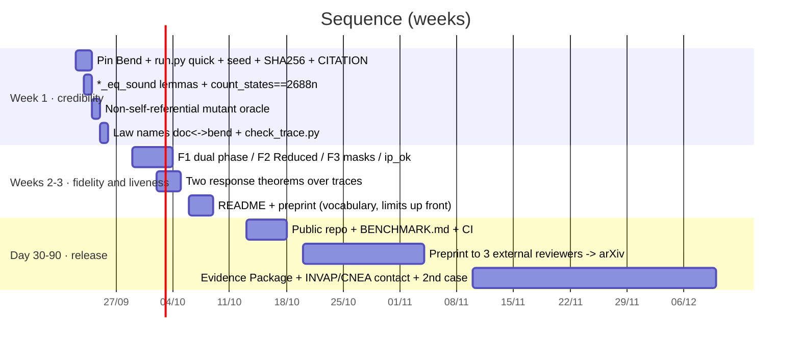

# Improvement plan — bend-spike / JET case (2026-09-21)

Result of an audit with six independent reviewers, one per perspective (fidelity to [S1]/[S2]/[S6],
formal methods, differential testing, functional safety IEC 61508/61513, market, docs/reproducibility)
and four designers. All 19 `PROOF*.bend` pass on Bend **2.0.24** (re-checked today; the repo pin is still at 2.0.6).

## Verdict

The **method** (laws → certificate by computation + reflection → differential testing against the implementation) is sound and
honest about its limits. The **case** promises more than it delivers on two fronts: fidelity to JET (three discrepancies
that an author of [S1] would object to) and reproducibility (a stranger does not reproduce it in an hour). The sellable asset is
the method —*proofs that do not grow with the configuration*—, not the JET case nor Bend.

## Findings that change the plan

| Area | Finding | Section |
|---|---|---|
| Fidelity | JTT relabels the phase and `concretize` reads the `Termination` row; local protection shuts down the whole system (R-9 says *one PINI*); unconditional CommFault/blind alarms (source: "*can* trigger", Level-1 masks) | [01](01-fidelity.md) |
| Formal | No `*_eq_sound` lemmas (cheap vacuity vector); no bounded liveness over traces; exhaustiveness of the enumeration not proven; `step_c_is_the_concrete_step` is `{==}` | [02](02-formal.md) |
| Testing | Self-referential mutant bank (5/6 constant mutants survive); Hypothesis without seed; `results.json` outside the repo | [03](03-testing-repro.md) |
| Repro | `env/bend.sh` does not pin a commit; `env/check_env.sh:27` uses `bend --version` (removed in 2.0.17: today it fails in a clean environment; it is `bend version`); `run.py --help` launches the 6-min gate; no `requirements`/`CITATION`/CI; 32/64 laws under a different name in the docs | [03](03-testing-repro.md) |
| Market | Single angle: verification per configuration; doors: I&C labs, DOE/NRC-fusion startups (INFUSE via lab), INVAP/CNEA RA-10; artifact: `BENCHMARK.md` + cs.SE preprint + Evidence Package | [04](04-market-artifacts.md) |

## Execution order

Vocabulary rule for everything that gets published: *decided by computation and lifted by reflection* ≠ independent
verification; the JET case is retrospective (machine closed in 2023) and is presented as the only machine-protection
dataset with published V&V.
