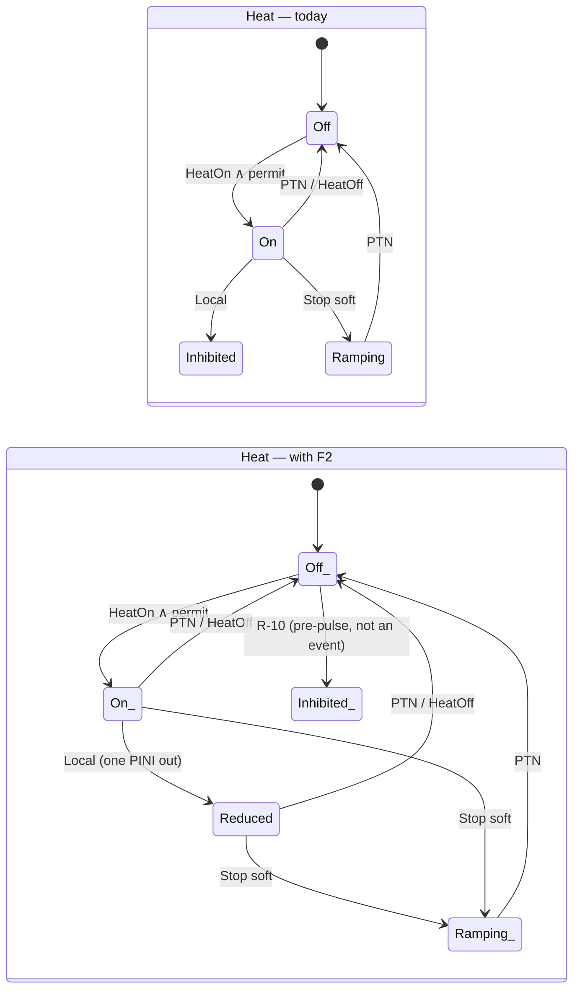

# 01 — Fidelity to [S1]/[S2]/[S6]: design of F1, F2, F3 and `ip_ok`

Date: 2026-09-21. Status: **design, not implemented**. Origin: fidelity audit (operations physicist
agent) over `v3/jetprot.bend` current rev. Bend 2.0.24: every operator carries its own `( .. : T)`;
a typed `let` is written `x : T = v`. Names of defs and laws are the real ones from the `.bend`.

Summary: the model transcribes Table 1 and the DMS sequence well, but at three points it asserts a policy
**different** from the published one without declaring it, and omits the only cheap verdict that covers 7/16 missed
disruptions of R-15. The four corrections are local (types + 4 defs + 9 laws), the certificate grows
from 2 688 to **21 504** states (×8), within what the seq3 pattern already supports (209 664 cells in C5).

---

## F1 — JTT does not contaminate the Table 1 row

**Problem.** `soft_apply` calls `jtt_phase(req, p)` and writes `Termination{}` into `Fin.phase`. From
then on `concretize(i, p, XAlarm{t})` consults `table(i, Termination, t)`: a later `Slow` or `Mchs`
in a discharge that was in Heating 2 maps to PTN and (A-1: JTT < PTN) escalates to a hard stop. [S2] §3.4
describes exactly this trap ("two views of time"): at JET the Table 1 phase is the **timed
phase of Level-1**, not that of the termination waveform that the JTT fires. Today the effect is not
declared in any A-n.

**(a) Types.** `Fin` now carries two phases; the table reads `prog`, the permissive and the DMS window read `wave`.

```bend
# programme phase (Level-1, the one that indexes Table 1) and wave phase (the one the JTT jumps)
type Fin is Data:
  Fin{prog: Phase, wave: Phase, level: Level, dms: Dms, plasma: Bool, nb: Heat, rf: Heat}

def jtt_phase(req: Level, p: Phase) -> Phase:      # unchanged: acts on wave
  match req:
    case LJtt{}:
      Termination{}
    case _:
      p

def soft_apply(+req: Level, f: Fin) -> Fin:
  match f:
    case Fin{pg, pw, l, d, pl, nb, rf}:
      Fin{pg, jtt_phase(req, pw), req, d, pl, ramp(nb), ramp(rf)}

def concretize(i: Inst, f: Fin, c: CEv) -> Ev:       # receives the Fin, not a Phase
  match c:
    case XAlarm{t}:
      +t2 = t
      +pg = prog_of(f)
      Stop{table(i, pg, t2), dms_req(dms_phase_of(f), t2)}
    ...
```

`Advance` advances **both** (`prog` and `wave` in lockstep until the JTT separates them); `wave` never
goes back; `prog` follows the Level-1 clock even if the JTT has jumped.

**(b) Laws.**

```bend
# F1a: the table row used by a concrete event is the programme phase, never the wave phase
law f1_table_reads_prog:
  for +i: S.Inst
  for +f: S.Fin
  for +t: S.Trig
  {S.stop_req_of(S.concretize(i, f, S.XAlarm{t})) == S.table(i, S.prog_of(f), t) : S.Level}

# F1b: a soft stop does not move the programme phase
law f1_soft_keeps_prog:
  for +o: S.Ord
  for +f: S.Fin
  for +req: S.Level
  {S.prog_of(S.soft_if(S.lvl_lt(o, S.level_of(f), req), req, f)) == S.prog_of(f) : S.Phase}

# F1c: wave >= prog always (new invariant I7, goes inside inv_fin)
law f1_wave_ahead:
  for +f: S.Fin
  for +h: {S.inv_fin(f) == True{} : Bool}
  {S.phase_le(S.prog_of(f), S.wave_of(f)) == True{} : Bool}
```

**(c) Certificate.** `wave` takes values ≥ `prog`: 28 pairs instead of 7 phases → 2 688 × 4 = **10 752**
states (not ×7, because of I7).

**(d) Register.** New **A-24**: "Table 1 is indexed by the Level-1 phase; the JTT moves only the
wave phase ([S2] §3.4)". A-5 (total order of phases) remains only for `prog`. No A-n is withdrawn.

```mermaid
flowchart LR
  subgraph antes["Today"]
    A1[Heating2] -->|JTT| A2[phase := Termination]
    A2 -->|Slow| A3["table(Termination, Slow) = PTN"]
    A3 --> A4[PTN: unpublished hard stop]
  end
  subgraph despues["With F1"]
    B1["prog=Heating2 / wave=Heating2"] -->|JTT| B2["prog=Heating2 / wave=Termination"]
    B2 -->|Slow| B3["table(prog=Heating2, Slow) = JTT"]
    B3 --> B4[the JTT continues: as in [S1] Table 1]
  end
```

---

## F2 — Local protection reduces, does not shut down

**Problem.** `local_fin` puts the unit into `Inhibited{}` for the rest of the pulse. R-9 ([S1] p.1295
"Local Protection"): *one PINI* is switched off "without the NB system as a whole having to stop delivering
power". The model does the opposite of the concept the paper introduces.

**(a) Types.**

```bend
type Heat is Data:
  Off{}
  Inhibited{}      # kept for the R-10 path (disabled pre-pulse), no longer used by Local
  Reduced{}        # partial power: one or more PINIs/antennas out, the unit keeps delivering
  Ramping{}
  On{}

def reduce(u: Heat) -> Heat:
  match u:
    case On{}:
      Reduced{}
    case u2:
      u2               # Off/Inhibited/Ramping/Reduced do not change

def local_fin(f: Fin, w: Who) -> Fin:
  match f w:
    case Fin{pg, pw, l, d, pl, nb, rf} Nb{}:
      Fin{pg, pw, l, d, pl, reduce(nb), rf}
    case Fin{pg, pw, l, d, pl, nb, rf} Rf{}:
      Fin{pg, pw, l, d, pl, nb, reduce(rf)}
```

`unit_rank`: `Off < Inhibited < Ramping < Reduced < On`. `ramp(Reduced) = Ramping`,
`deenergize(Reduced) = Off`, `turn_on(ok, Reduced) = Reduced` (a reduced unit does not return to `On` without
`Reset`; conservative, declared).

**(b) Laws.**

```bend
# F2a: Local never switches off nor inhibits a unit that was delivering power
law f2_local_keeps_power:
  for +f: S.Fin
  for +w: S.Who
  {S.implies(S.is_on(S.unit_of(w, f)), S.is_reduced(S.unit_of(w, S.local_fin(f, w)))) == True{} : Bool}

# F2b: Local does not touch the other unit nor the level (frame; replaces the Local arm of p9)
law f2_local_frame:
  for +f: S.Fin
  for +w: S.Who
  {S.fin_eq_except_unit(w, f, S.local_fin(f, w)) == True{} : Bool}

# F2c: a reduced unit still obeys the stops (Ramping under RTPS, Off under PTN)
law f2_reduced_still_stops:
  for +o: S.Ord
  for +f: S.Fin
  for +e: S.Ev
  for +bt: Bool
  for +bh: Bool
  {S.pr_stop_no_full_power(S.step_fin(o, f, e, bt, bh)) == True{} : Bool}
```

**(c) Certificate.** `Heat` goes from 4 to 5 values in two units: ×(25/16) → on top of F1: **16 800**.

**(d) Register.** A-6 is rewritten ("one unit = one system with full or partial power"); A-9 adds
the `Reduced` row. Citation: [S1] p.1295, "Local Protection". `stop_no_full_power` and
`termination_no_full_power` remain valid (`Reduced` is not `On`).



---

## F3 — CommFault and blind alarms go through masks

**Problem.** `step_fin` treats `CommFault{dms}` as `arm_if(dms, to_ptn(f))`: unconditional PTN. [S1]
p.1296 "Ensuring Reliability": the loss of communication "**can** trigger the PTN" and "features or
subsystems not in use cannot cause problems" — Level-1 conditions those checks. It is exactly the
band where [S6] reports 5 missed disruptions due to "inhibits" (R-15). Blind alarms are alarms
from the VTM that **go through the table**, not a direct path.

**(a) Types.** The masks are configuration (payload of the `Inst`, like the matrix), not state.

```bend
type Mask is Data:
  Mask{comm: Bool, blind: Bool}       # True = the check is enabled in this pulse

def mask_of(i: Inst) -> Mask: ...     # Inst1: both True (as today); Inst2: same; Inst3: comm False

def comm_fin(m: Mask, f: Fin, d: Bool) -> Fin:
  match m:
    case Mask{c, b}:
      match c:
        case True{}:
          arm_if(d, to_ptn(f))
        case False{}:
          f
```

In `step_fin`, `case CommFault{dms}: comm_fin(mask_of(i), f, dms)` — `step_fin` gains the parameter `i`
(or the `Mask` is passed as payload, just like `Ord`). Blind alarm: new `Trig.Blind{}` that enters through
`table(i, prog, Blind)` like any trigger (R-2 + p.1296).

**(b) Laws.**

```bend
# F3a: check enabled ⇒ CommFault leads to PTN (what holds unconditionally today)
law f3_comm_enabled_trips:
  for +f: S.Fin
  for +d: Bool
  {S.is_ptn(S.level_of(S.comm_fin(S.Mask{True{}, True{}}, f, d))) == True{} : Bool}

# F3b: check disabled ⇒ CommFault is the identity (the law that certifies configuration A-21)
law f3_comm_masked_is_noop:
  for +f: S.Fin
  for +d: Bool
  for +b: Bool
  {S.fin_eq(S.comm_fin(S.Mask{False{}, b}, f, d), f) == True{} : Bool}

# F3c (conformance): the published instance has both checks enabled
law f3_inst1_all_checks_on:
  {S.mask_of(S.Inst1{}) == S.Mask{True{}, True{}} : S.Mask}
```

**(c) Certificate.** No new state; the mask multiplies the **instances** (2 → 4 useful
combinations), not the cells per instance. Cost: ×2 in conformance C1/C5.

**(d) Register.** A-21 stops being "no bypass" and becomes "bypass modelled only for comm/blind; PTN inputs
and outputs (R-10) remain outside". New **A-25**: "a blind alarm is a table trigger".
Citation: [S1] p.1296.

---

## `ip_ok` — DMV current threshold (A-22)

**Problem.** R-14/[S6]: the DMV is only enabled with `Ip` above threshold; 7 of the 16 missed
disruptions of R-15 are of this kind. Today `dms_req` depends only on the per-phase window.

**(a) Types.** A `Bool` in `Fin`, updated by a new event, exactly like `plasma`.

```bend
type Fin is Data:
  Fin{prog: Phase, wave: Phase, level: Level, dms: Dms, plasma: Bool, ip_ok: Bool, nb: Heat, rf: Heat}

type Ev is Data:
  ...
  Ip{ok: Bool}                         # the verdict Ip >= threshold, like Plasma{ok}

def dms_req(p: Phase, ip: Bool, t: Trig) -> Bool:
  Bool.and(dms_window(p), Bool.and(ip, dms_trig(t)))
```

**(b) Laws.**

```bend
# IP1: without sufficient current the DMS never arms, whatever the phase and the trigger
law ip_low_never_arms:
  for +o: S.Ord
  for +f: S.Fin
  for +e: S.Ev
  for +bt: Bool
  for +bh: Bool
  for +h: {S.ip_ok_of(f) == False{} : Bool}
  {S.implies(S.is_idle(S.dms_of(f)), S.is_idle(S.dms_of(S.step_fin(o, f, e, bt, bh)))) == True{} : Bool}

# IP2 (demand): with current, window and DMS trigger, the alarm arms in the same step
law ip_ok_arms_on_demand:
  for +i: S.Inst
  for +f: S.Fin
  for +t: S.Trig
  for +h: {Bool.and(S.ip_ok_of(f), Bool.and(S.dms_window(S.wave_of(f)), S.dms_trig(t))) == True{} : Bool}
  {S.is_armed(S.dms_of(S.step_c(i, S.St{f, 0n, 0n}, S.XAlarm{t}))) == True{} : Bool}
```

**(c) Certificate.** ×2 → on top of F1+F2: **33 600**. If containment is desired, `ip_ok` can go as payload of the
`XAlarm` event (verdict, no state): certificate ×1, but IP1 is lost as a state invariant.
Recommendation: state (it is what the operator configures and what [S6] audits).

**(d) Register.** A-22 is withdrawn; **R-14 modelled** comes in. Citation: [S6] §3 (DMV window + threshold),
[S2] §3.3.

---

## Order and budget

| Item | Files | Effort | Risk | States | What it unblocks |
|---|---|---|---|---|---|
| F1 dual phase | `jetprot.bend` (Fin, soft_apply, concretize, advance), `enum_jetprot.bend`, 3 laws, pymodel | 1 day | medium: touches `concretize`, 17/62 mutants depend on C1 → re-measure | 10 752 | What an author of [S2] objects to first |
| F2 `Reduced` | `jetprot.bend` (Heat, local_fin, ranks), 3 laws, pymodel, mutants | ½ day | low | ×1.56 | Coherence with R-9; the paper is no longer contradicted |
| F3 masks | `jetprot.bend` (Mask, comm_fin, Trig.Blind), `Inst3`, 3 laws, C1/C5 ×2 | ½ day | low | ×1 (×2 instances) | Certifying configuration = the A-21 argument |
| `ip_ok` | `jetprot.bend` (Fin, Ev.Ip, dms_req), 2 laws, pymodel | ½ day | low | ×2 | 7/16 misses of R-15 |
| Total | — | 2.5 days + 1 day of re-testing (PROOF_*: certificates ×12.5, ~30 min JS checker) | — | **33 600** | Honest framing: "the Stop Selector according to [S1]/[S2]", not "an inspired policy" |

Order: F2 → `ip_ok` → F3 → F1 (F1 last because it changes the signature of `concretize` and forces re-measuring the
mutant bank; the other three are additive). Each item closes with `All terms check.` in
`PROOF_JETPROT.bend` and `py -3.14 v3/run.py` green before the next one.

Out of scope for this document (other forks): `*_eq_sound` laws, liveness over traces,
mutant oracle, reproducibility.
