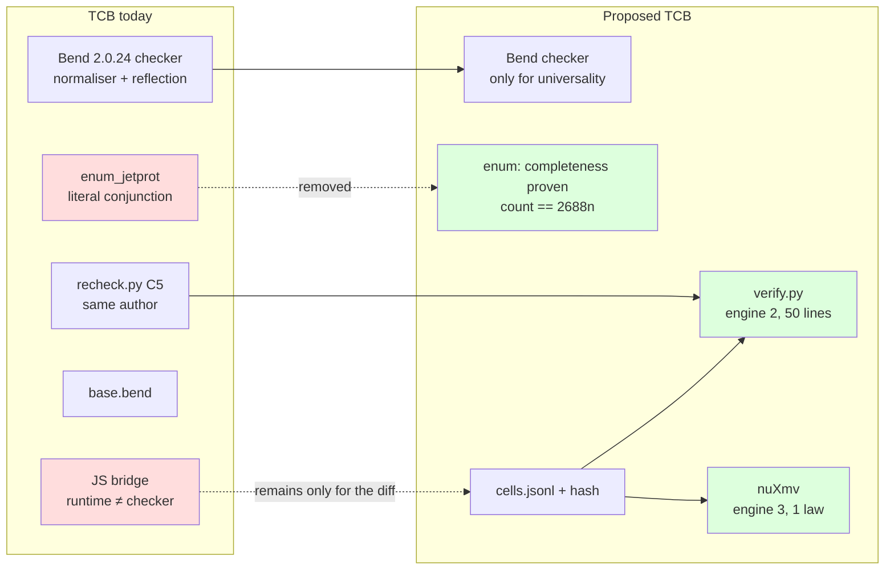
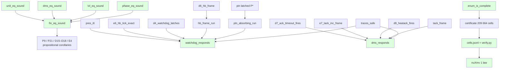

# 02 — Formal guarantees: soundness, response over traces, exhaustiveness, exportable certificate

Date: 2026-09-21. Base: `v3/jetprot.bend`, `v3/LAWS_JETPROT.bend`, `v3/enum_jetprot.bend` (Bend 2.0.24). Origin: formal methods audit (findings Q1–Q4 in `project-bend-spike`). None of this changes the model; it adds laws and artifacts around it.

## 0. What gets closed

| Gap | Symptom | Closure |
|---|---|---|
| Boolean equalities without a propositional bridge | `fin_eq`, `unit_eq`, `lvl_le` are model code; a `unit_eq` that confuses `Off`/`Inhibited` vacuates P9/P21/D15–D18/E4 without Bend seeing it | §1: `*_sound` lemmas |
| No response over traces | `traces_safe` is an invariant; nobody proves "watchdog ⇒ PTN in ≤ hb_max ticks" | §2: two bounded response theorems |
| Enumeration not proven exhaustive | `all_level` is a literal conjunction; an omitted constructor passes silently | §3: `count_states == 2688n` + total `match` |
| Certificate tied to the Bend checker | TCB = 2.0.24 normaliser with no published metatheory | §4: exported cells + external verifier + nuXmv cross-check |

## 1. Soundness lemmas (≤ 1 h each)

Cookbook §3.4 pattern ("verdict splits"): the hypothesis is `f(a,b) == True{}`; one does `match a b:` over all pairs; the diagonal arms close with `{==}`; the off-diagonal arms have hypothesis `False{} == True{}` and are refuted with `Empty.absurd` via a lemma `Bool.false_ne_true`. None needs induction.

```bend
# LAWS_JETPROT_SOUND.bend
import Base
import ./jetprot.bend as S

# unit_eq is the equality on Heat (4x4 = 16 arms, 4 diagonal ones by {==})
law unit_eq_sound:
  for +a: S.Heat
  for +b: S.Heat
  for -h: {S.unit_eq(a, b) == True{} : Bool}
  {a == b : S.Heat}

law dms_eq_sound:
  for +a: S.Dms
  for +b: S.Dms
  for -h: {S.dms_eq(a, b) == True{} : Bool}
  {a == b : S.Dms}

law lvl_eq_sound:
  for +a: S.Level
  for +b: S.Level
  for -h: {S.lvl_eq(a, b) == True{} : Bool}
  {a == b : S.Level}

law phase_eq_sound:   # 7x7 = 49 arms: generate with a script, not by hand
  for +a: S.Phase
  for +b: S.Phase
  for -h: {S.phase_eq(a, b) == True{} : Bool}
  {a == b : S.Phase}

# fin_eq decomposes into the six above (Bool.and_elim_l/r from kit §8)
law fin_eq_sound:
  for +a: S.Fin
  for +b: S.Fin
  for -h: {S.fin_eq(a, b) == True{} : Bool}
  {a == b : S.Fin}

# lvl_le is a total order per Ord: reflexive, antisymmetric, transitive
law lvl_le_refl:
  for +o: S.Ord
  for +a: S.Level
  {S.lvl_le(o, a, a) == True{} : Bool}

law lvl_le_antisym:
  for +o: S.Ord
  for +a: S.Level
  for +b: S.Level
  for -h1: {S.lvl_le(o, a, b) == True{} : Bool}
  for -h2: {S.lvl_le(o, b, a) == True{} : Bool}
  {a == b : S.Level}
```

Proof scheme (one; the others are copies):

```bend
def unit_eq_sound(a: S.Heat, b: S.Heat, -h: {S.unit_eq(a, b) == True{} : Bool}) -> {a == b : S.Heat}:
  match a b:
    case S.Off{} S.Off{}:            {==}
    case S.Off{} S.Inhibited{}:      Empty.absurd(false_ne_true(h))   # h : {False{} == True{} : Bool}
    ...                              # 16 arms; the 4 diagonal ones are {==}
```

`false_ne_true` (kit §8): `def false_ne_true(-e: {False{} == True{} : Bool}) -> Empty` by `match` over the equation with a predicate that distinguishes constructors (cookbook §3.6 "refutation").

Note 2.0.24: since `unit_eq` goes through `Nat.is_eq(unit_rank(a), unit_rank(b))`, the checker reduces `unit_rank(Off{})` to `0n` by computation; the arms close without `Nat` lemmas. `fin_eq` needs to decompose `Bool.and(x, y) == True{}` into `x == True{}` and `y == True{}`: two 4-line lemmas.

**Effect:** every frame law that today concludes `S.fin_eq(f, f2) == True{}` gains a propositional corollary `f == f2` for free (`Equal.trans` with the lemma). The mutant "unit_eq confuses Off/Inhibited" now fails in Bend, not only in C5 Python.

## 2. Response theorems over traces (½ day each)

**Status (2026-09-21): done, blocker 5** (`docs/STATUS_2026-09-21.md` §4.5). Differences from what is below: the
hypotheses go with `+` (they are used twice), the bound is written `Nat.is_le(S.hb_max(), ticks(trace))`, the facts that
the induction uses are `step_safe` + P1, D4 (watchdog) and D7, D8, P15, P18, E11 (DMS), not E6/D6/E8, and they are not open
laws but template hypotheses of the core (Bend rejects live code that calls an unfilled law).

Today: `traces_safe` (invariant for every trace). Missing: *something happens* within a bound. No infinite liveness (Bend has no ◇), but **bounded** response is an invariant over traces of fixed length and is proven by induction on the trace.

### 2.1 Watchdog: `hb_max` ticks without heartbeat ⇒ latched PTN

```bend
# a trace of n events that contains neither Heartbeat nor Reset (decidable predicate)
def no_hb(trace: List<&2, S.Ev>) -> Bool: ...        # List.all over negated is_heartbeat/is_reset
def ticks(trace: List<&2, S.Ev>) -> Nat: ...          # counts Tick

law watchdog_responds:
  for +o: S.Ord
  for +s: S.St
  for -h_inv: {S.inv_all(s) == True{} : Bool}
  for +trace: List<&2, S.Ev>
  for -h_nohb: {no_hb(trace) == True{} : Bool}
  for -h_len: {Nat.is_ge(ticks(trace), S.hb_max()) == True{} : Bool}
  {S.is_ptn(S.level_of(S.fin_of(S.run_o(o, trace, s)))) == True{} : Bool}
```

Inductive scheme over `trace` with a strengthened invariant `hb_of(s) + ticks(rest) >= hb_max ∨ is_ptn`:
- case `[]`: `ticks = 0`, the hypothesis forces `hb_max <= hb`; with **I6** (`hb <= hb_max` while not PTN) and **E6** (`hb == hb_max ⇒` the next Tick latches)... the empty case requires that it already be PTN: it closes with I6 + `Nat` antisymmetry.
- case `Tick :: rest`: **E6** (`e6_hb_tick_exact`: Tick without heartbeat increments `hb` exactly or latches) + **D4** (`d4_watchdog_latches`: `hb == hb_max` ⇒ `is_ptn` after the step) + inductive hypothesis over `rest` with `hb+1`.
- case other event without heartbeat: **D6** (`d6_hb_frame`: `hb` does not go down) + I.H.
- `is_ptn` is absorbing: reuses the level `pres_i*` (PTN never goes down: existing P law `ptn_latched`).

New lemmas: `hb_frame_run` (by induction, `hb` does not decrease without heartbeat), `ptn_absorbing_run` (once PTN, `run_o` preserves it). The `for +` over `s` and `o` because the I.H. reuses them; the `-h` hypotheses are used once each per arm (if needed twice: `+h`, and `Bool` is `Data`).

### 2.2 DMS: armed ⇒ `Fired` in ≤ `ack_max` ticks

```bend
law dms_responds:
  for +o: S.Ord
  for +s: S.St
  for -h_inv: {S.inv_all(s) == True{} : Bool}
  for -h_armed: {S.is_armed(S.dms_of(S.fin_of(s))) == True{} : Bool}
  for +trace: List<&2, S.Ev>
  for -h_noreset: {no_reset(trace) == True{} : Bool}
  for -h_len: {Nat.is_ge(ticks(trace), S.ack_max()) == True{} : Bool}
  {S.is_fired(S.dms_of(S.fin_of(S.run_o(o, trace, s)))) == True{} : Bool}
```

Reuses **D7** (`d7_ack_timeout_fires`), **D8/E7** (`tack` counts exactly), **D9/E11** (HeatAck fires earlier) and `tack_frame`. Same shape as 2.1; the strengthened invariant is `tack + ticks(rest) >= ack_max ∨ is_fired`. Both theorems are **universal in `hb_max`/`ack_max`**: they do not consult the certificate; they hold if tomorrow `hb_max = 25`.

## 3. Exhaustiveness of the enumeration (2 h)

```bend
# enum_jetprot.bend
def count_fin() -> Nat: ...      # fold of the same all_* pyramid with Nat.add instead of Bool.and
law enum_is_complete:
  {count_fin() == 2688n : Nat}   # 7·4·3·2·4·4 — closes by computation, {==}

# all_level with total match: an omitted constructor is a type error, not silence
def all_level(+o: S.Ord, +p: S.Phase) -> Bool:
  fold_level(o, p, S.LNone{}) ...   # or: def each_level(k: Level -> Bool) -> Bool with match over a "witness" Level
```

The robust form: a `def levels() -> List<&2, S.Level>` with a law `levels_complete: for +l: S.Level {List.contains(levels(), l) == True{}}` proven by `match l:` (4 arms `{==}`). Likewise `phases()`, `dmss()`, `heats()`. Then `check_fin` is `List.all` over the product and completeness is a theorem, not a convention.

## 4. Exportable certificate and external cross-check (1 day)

**Cell JSON schema** (`v3/certificate/cells.jsonl`, one line per cell, 2 orders × 104 832):

```json
{"ord":"Ord1","fin":{"phase":"Heating2","level":"LNone","dms":"DmsIdle","plasma":true,"nb":"On","rf":"On"},
 "ev":"Stop","bt":false,"bh":true,"fin2":{...},"props":{"g_a":true,"g_b":true,"g_c":true,"g_d":true,"g_e":true}}
```

`v3/certificate/MANIFEST.json`: `{"bend":"2.0.24","commit":"e52cda4","jetprot_sha256":..., "cells_sha256":..., "count":209664}`.

**External verifier** (`v3/certificate/verify.py`, ~50 lines): walks `cells.jsonl`, recomputes `fin2` with `pymodel/jetprot_ref.py::step_fin` and the 5 props with an independent transcription of `prop_at`, requires 209 664 lines and all `true`, and compares the hash. **It does not trust Bend**: it is the same evidence decided by a second engine (it almost exists already in `recheck.py::c5`; the format and the hash are missing).

**nuXmv cross-check of one law** (`v3/certificate/jetprot.smv`, generated from `jetprot_ref.py`): the module has the 6 fields of `Fin` + `hb`, `tack` bounded to `0..hb_max`; `INVARSPEC` with `d4_watchdog_latches` translated and `LTLSPEC G (hb = hb_max & !heartbeat -> X is_ptn)`. What it proves: that an independent model checker, with its own semantics, accepts the same property over the same table. What it does not prove: universality in `hb_max` (nuXmv fixes it) — that stays in Bend, and that is the division of labour to explain in the preprint.

## 5. TCB before / after



## 6. Dependencies between new and existing laws



## 7. Effort / credibility

| Item | Effort | Risk | What it gains in credibility |
|---|---|---|---|
| `*_eq_sound` (5 lemmas) + `lvl_le` order | 2–3 h (49 arms of `phase_eq` by script) | low | Closes the cheapest vacuity vector; the frame laws become propositional |
| `watchdog_responds` | ½ day | medium: the induction requires the strengthened invariant; bend-prover agent per lemma | First *response* result; universal in `hb_max` |
| `dms_responds` | ½ day (copy of the previous one) | medium | Same for the DMS |
| `enum_is_complete` + complete lists | 2 h | low | Exhaustiveness stops being a convention |
| `cells.jsonl` + `verify.py` + MANIFEST | ½ day | low | Auditable evidence without trusting Bend; reproducible with hash |
| nuXmv 1 law | 1 day (manual translation) | medium: semantics of counters | Third independent engine; answers "what if the checker lies?" |

Recommended order: soundness → exhaustiveness → export → response → nuXmv. The first three do not touch existing proofs; the current PROOFs keep passing (verified on 2.0.24, 19/19).
