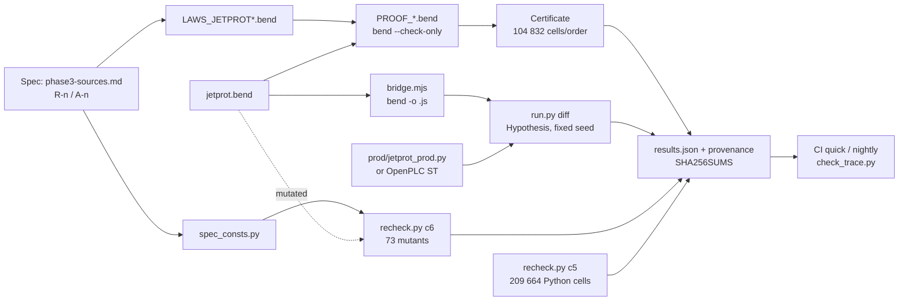
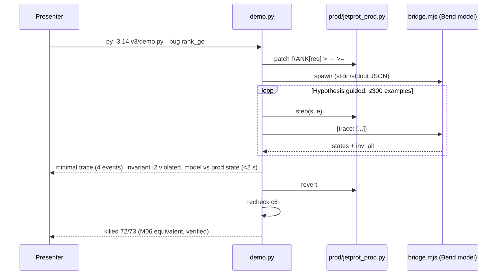

# 03 — Differential testing and reproducibility: design of improvements

Date: 2026-09-21. Origin: audit by 6 agents (simulation/testing, docs/preprint). Status: **§1–§4 applied on 2026-09-21** (see `docs/STATUS_2026-09-21.md` §4, blockers 2 and 3, with the differences with respect to this design); §5 (`check_trace.py`), §6 (CI) and §7 (demo) remain as design.
File and function names are the real ones from the repo (`v3/run.py`, `v3/recheck.py`, `v3/pymodel/mutants.py`,
`env/bend.sh`, `env/check_env.sh`).

## 0. One-line diagnosis per item

| # | Problem today | Evidence |
|---|---|---|
| 1 | The mutant bank is **self-referential**: `recheck.c6` restores 13 names from `ORIG` and the laws are evaluated with the constants of the mutated model | 5/6 constant mutants survive (`HB_MAX=4`, `ACK_MAX=3`, `INIT plasma=True`, `INIT in IpRise`, `heat_win ∋ Xpoint`) |
| 2 | `results.json` **is neither reproducible nor auditable** | `hypothesis.find` without seed; no versions/hashes; the file is in `.gitignore` and the README cites its numbers |
| 3 | `v3/run.py` has no CLI: `--help` launches the 5–6 min gate | `main()` without `argparse` |
| 4 | Bend is not pinned: `env/bend.sh` clones `--depth 1` of `main` | today it brings 2.0.24; the spike was run on 2.0.6 (passes anyway, verified 2026-09-21) |
| 5 | Broken traceability in names: 32/64 laws with a different name in the docs, 8 missing | `phase3-traceability.md` vs `LAWS_JETPROT.bend` |
| 6 | No CI, no tag, no `CITATION.cff`, no `requirements.txt` | `git log`: 2 commits |
| 7 | No short demo nor path to a real target | the first useful output takes 5 min |

## 1. Non-self-referential mutant oracle

**Design.** The specification constants leave the model and live in `v3/pymodel/spec_consts.py`, which
**only the laws** import (`catching_laws`, `inv_all`, C1–C5). `jetprot_ref.py` keeps its own copies
(they are "the model"); a mutant that changes them no longer drags the oracle along.

```python
# v3/pymodel/spec_consts.py  — what the spec fixes; NEVER imported by jetprot_ref.step_*
HB_MAX, ACK_MAX = 3, 2                       # A-11, A-13 (see 01-fidelidad for real values)
PHASES = ["Breakdown", "IpRise", "Limiter", "Xpoint", "Heating1", "Heating2", "Termination"]  # R-1
RANK = {1: {"LNone": 0, "LJtt": 1, "LRtps": 2, "LPtn": 3}, 2: {"LNone": 0, "LJtt": 2, "LRtps": 1, "LPtn": 3}}
INIT = ("Breakdown", "LNone", "DmsIdle", False, "Off", "Off")                                 # R-5
DMS_WINDOW = {"Xpoint", "Heating1", "Heating2", "Termination"}                                # R-13 / [S6]
HEAT_WIN = {"Heating1", "Heating2"}                                                           # A-6
```

`recheck.c6`: extend `ORIG` to **every** public symbol of `R` (`{k: getattr(R,k) for k in dir(R) if not k.startswith("_")}`)
and restore via `vars(R).update(ORIG)`; that way a mutant can touch constants and functions alike.

**New mutants (11).** Convention `M63_…`, plausibility 1–5, `patch()` returns `{name: value}`:

| Name | What it mutates (`jetprot_ref.py`) | Law that should catch it |
|---|---|---|
| `M63_hb_max_4` | `HB_MAX = 4` | I6/E6 with `spec_consts.HB_MAX` (survives today) |
| `M64_ack_max_3` | `ACK_MAX = 3` | D4/E5 (survives today) |
| `M65_init_plasma_true` | `INIT[3] = True` | new `init_is_spec` (`step_st` from `INIT` ≡ spec) |
| `M66_init_iprise` | `INIT[0] = "IpRise"` | `init_is_spec` |
| `M67_heat_win_xpoint` | `HEAT_WIN ∋ "Xpoint"` in `step_fin` (HeatOn) | D15/P9 with `spec_consts.HEAT_WIN` |
| `M68_dms_window_no_term` | `DMS_WINDOW − {"Termination"}` | D9 (`heatack_fires`) in Termination |
| `M69_rank2_jtt_ge_rtps` | `RANK[2]["LJtt"] = 1` (tie) | P2/total order (`lvl_le_sound`, see 02-formal) |
| `M70_heatack_ignored_in_term` | `step_c` ignores `XHeatAck` if `phase == Termination` | D9 |
| `M71_reset_fired_needs_plasma_false` | `reset_ok`: `DmsFired` accepted only if `plasma == False` | D10/E8 (guard spelled out against `spec_consts`) |
| `M72_inv_all_hb_le` | `inv_all`: `hb <= HB_MAX` (mutate the oracle) | meta-test: the spec `inv_all` and the model `inv_all` must agree on 2688×39 cells |
| `M73_c1_only_dep` | `concretize` correct but `table` with one changed cell | C1 **and** at least one other law (measures the 17/62 dependence on C1) |

New meta-metric in `results["C6"]`: `laws_per_kill` (histogram) — how many laws catch each mutant;
a mutant caught by a single law is a weak point to document.

## 2. Reproducibility of the evidence

- `run.diff`: `settings(max_examples=MAX_EXAMPLES, database=None, deadline=None, derandomize=True)` **or**
  `seed = int(os.environ.get("BS_SEED", 20260921))` + `@seed(seed)`; the seed goes into the JSON.
- `provenance` block in `results.json` (written by `run.main` before any gate):

```json
"provenance": {
  "timestamp_utc": "2026-09-21T18:40:00Z",
  "bend": {"version": "2.0.24", "commit": "e52cda4", "src": "~/.bend-src"},
  "bun": "1.x", "node": "22.22.2", "python": "3.14.3", "hypothesis": "6.168.0",
  "seed": 20260921, "max_examples": 3000,
  "sha256": {"v3/jetprot.bend": "…", "v3/enum_jetprot.bend": "…", "v3/LAWS_JETPROT.bend": "…",
             "v3/LAWS_JETPROT_CONF.bend": "…", "v3/PROOF_JETPROT.bend": "…",
             "v3/pymodel/jetprot_ref.py": "…", "v3/prod/jetprot_prod.py": "…", "v3/bridge.mjs": "…"},
  "host": {"os": "Windows 11 10.0.26200", "cpu": "…"}
}
```

- Take `results.json` and `recheck.json` out of `.gitignore`; commit them as **reference** alongside `SHA256SUMS`
  (`sha256sum v3/results.json v3/recheck.json v3/*.bend > SHA256SUMS`). A third party runs `run.py all` and
  compares: same `gates`, same `killed/total`, same minimal traces (because of the seed), same cell hash.
- `requirements.txt`: `hypothesis==6.168.0`, `jax[cpu]==<pin>` (only `heat/`), `numpy==<pin>`.
- `CITATION.cff` (`cff-version: 1.2.0`, preprint title, `type: software`, `license: Apache-2.0`,
  human author + AI authorship note in `abstract`).

## 3. `v3/run.py` with CLI

```
py -3.14 v3/run.py quick      # ~45 s: CONF (PROOF_JETPROT_CONF) + 1 negative + guided diff 200 examples + provenance
py -3.14 v3/run.py proofs     # ~150 s (2.0.24, JS checker): PROOF_JETPROT + CONF + 10 negatives
py -3.14 v3/run.py diff       # ~60–120 s: 32 runs × 3000 examples, fixed seed
py -3.14 v3/run.py mutants    # ~90 s: recheck C6 with extended bank (73)
py -3.14 v3/run.py recheck    # ~60 s: C2 vacuity, C3, C5 (209 664 cells)
py -3.14 v3/run.py all        # ~6 min: everything + results.json + SHA256SUMS
py -3.14 v3/run.py demo       # see §7
```

`argparse` with `subparsers`; `--seed`, `--max-examples`, `--json <path>`; `--help` prints the timing table.
Each subcommand writes its part of `results` and `all` merges them. `quick` is the CI gate on every push.

## 4. Bend pin and migration

- `env/bend.sh`: `BEND_COMMIT=e52cda4f…` (2.0.24, verified today: 19/19 PROOF pass); after cloning,
  `git -C "$SRC" fetch --depth 200 origin && git -C "$SRC" checkout -q "$BEND_COMMIT"`. `--update` becomes
  `--update <commit>` and rewrites the pin in the script itself.
- `env/check_env.sh`: `check "bend version" "bend 2.0.24"` (line 27 uses `--version`, which 2.0.17 removed →
  today it gives FAIL) and `check "bend commit" "$BEND_COMMIT" "$(git -C "$SRC" rev-parse HEAD)"` with **exit ≠ 0** if it differs.
  Replace `py -3.14` with `${PY:-py -3.14}` for Linux/macOS (`PY=python3.14`).
- Strategy: migrate the pin to 2.0.24 **now** (nothing breaks; the operators already carried `( .. : T)`), and
  re-pin only on releases with `Breaking:` in `CHANGELOG.md`.

## 5. `docs/check_trace.py` (traceability doc ↔ `.bend`)

Extracts `law <name>` from `v3/LAWS_JETPROT*.bend` and every law-shaped token `[a-z][a-z0-9_]{6,}` from
`phase3-traceability.md` and `phase3-design.md`; prints three lists: laws without a row in the docs, names in the docs without a
law, and R-n/A-n/H-n/SR-n cited without a definition (`phase3-sources.md`, `phase3-safety.md`). Exit = number of
orphans; runs in `quick`. First fix: rename in the docs to `d1_stop_honoured`…`e11_…` and add the 8 missing ones.

## 6. CI (GitHub Actions, Linux, no clang)

```yaml
on: [push, pull_request, schedule: {cron: "0 3 * * *"}]
jobs:
  quick:  {runs-on: ubuntu-latest, steps: [checkout, setup-python 3.14, oven-sh/setup-bun, node 22,
           "bash env/bend.sh version", "pip install -r requirements.txt", "python v3/run.py quick",
           "python docs/check_trace.py"]}
  nightly: {if: schedule, timeout-minutes: 30, steps: [..., "python v3/run.py all", "sha256sum -c SHA256SUMS"]}
```

Badge in the README; the nightly `all` compares against the committed `results.json` and fails if `killed/total` drops.

## 7. 3-minute demo and path to a PLC

`v3/demo.py`: (1) shows `prod/jetprot_prod.py:RANK`; (2) applies a patch chosen by flag
(`--bug rank_ge | window | reset`), (3) runs `diff --guided --max-examples 300` and in <2 s prints the shrunk minimal
trace, the violated Bend invariant and the final state side by side (model vs prod); (4) reverts and
closes with `mutants` showing `killed/total`. No proof gates (they are already in `results.json` with hash).

Path to a real target, from cheapest to most expensive: (a) generate **IEC 61131-3 ST** from `jetprot_ref.step_fin`
(pure table → `CASE`), run it on OpenPLC and feed `run.diff` over Modbus (only `prod.run` changes);
(b) `bend -o jetprot.c` + CFFI harness (needs clang; not on this machine); (c) Stateflow (licence).

## Diagrams





## Effort / impact

| Item | Effort | Impact | Risk |
|---|---|---|---|
| 1 `spec_consts.py` + total `ORIG` + 11 mutants | 3 h | High: the 61/62 becomes a defensible number | May lower the published score (good: it is the real one) |
| 2 seed + provenance + commit results + SHA256SUMS + requirements + CITATION | 1.5 h | High: reviewer-killer #1 resolved | None |
| 3 `run.py` CLI with `quick` | 1.5 h | High: "try in 60 s" possible | None |
| 4 Bend pin + hard `check_env` + portable `PY` | 40 min | High | `--version` FAILs today: fix first |
| 5 `check_trace.py` + rename in the docs | 1.5 h | Medium: auditable traceability | None |
| 6 CI quick/nightly + badge | 1 h | Medium | Runner without clang: JS lane only (declare it) |
| 7 `demo.py` | 2 h | High for sales; nil for credibility | — |
| 7b ST/OpenPLC | 2–3 days | High: first "real" target | State↔register mapping, lost events |
