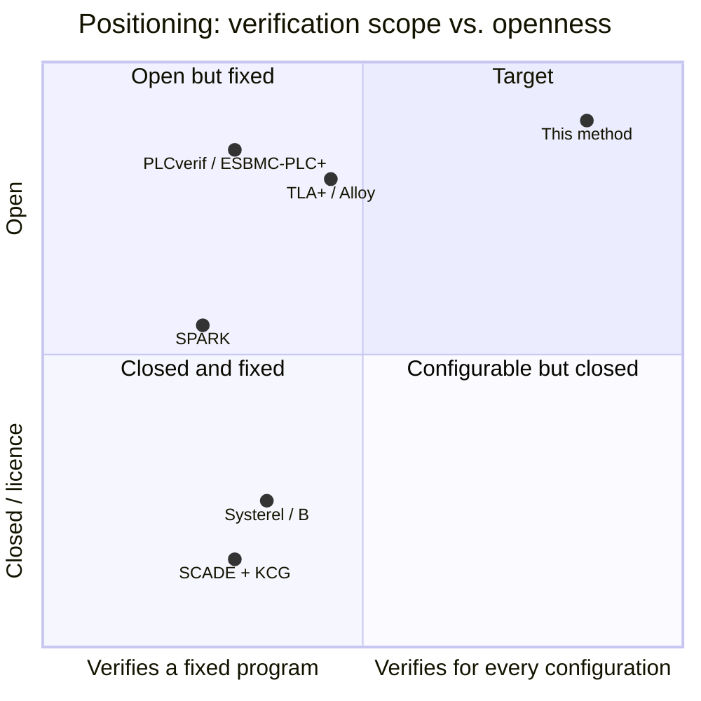
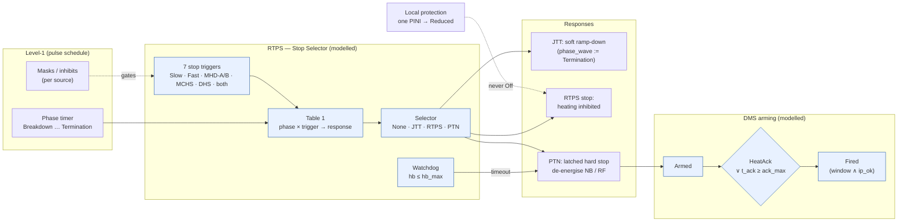
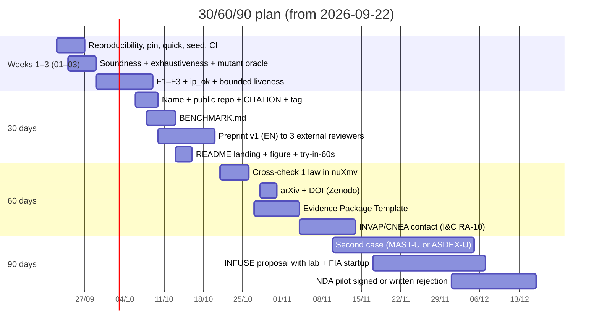

# 04 — Market and artifacts: what to show, to whom, and in what order

Date: 2026-09-21. Input: six-perspective audit (fidelity, formal, testing, functional safety, market, docs).
Scope: positioning, public benchmark, preprint, Evidence Package, README and 30/60/90 plan. Does not touch the model (see 01–03).

## 1. Positioning

**One sentence.** *Reference models of protection logic whose laws are proven for every trace and every configuration, re-certifiable in minutes when the matrix changes — open (Apache 2.0) and auditable without trusting the verifier.*

**Single angle: "proofs that do not grow with the configuration".** The phase × trigger → response matrix travels as event payload; the 64 laws hold for *every* matrix, and a new configuration is certified by computation (104 832 cells per order, 5–6 min) without rewriting any proof. The pain is documented in the source itself: [S6] records 16 missed disruptions in 2011-12 due to misconfigured inhibits and windows — *configuration* failures, not code failures. No competitor verifies that: they verify a fixed program.

Discarded as angles: "Bend 2 + GPU" (nobody buys a language without a track record; it is mentioned, not sold), "a method for the whole Argentine nuclear industry" (a 5-year thesis without an anchor customer) and "61/62 mutants" (credibility support, not an angle; besides, the bank has a self-referential bias that 03 corrects).

| Tool | What it verifies | Fixed vs. per configuration | Liveness / counterexamples | Licence | Qualification (61508-3 §7.4.4) |
|---|---|---|---|---|---|
| PLCverif (CERN) / ESBMC-PLC+ | PLC code (SCL/ST), bounded model checking | fixed program | yes / yes | GPL / open | not qualified; in production use at CERN since 2019 |
| Systerel / CLEARSY (B, Atelier B) | spec → code refinement | fixed program | not native / proof | commercial + free Atelier B | SIL 4 railway (Météor) |
| SCADE (Ansys) | synchronous model + KCG | fixed program | model checking (Design Verifier) | commercial | KCG qualified (nuclear Cat. A, DO-178C) |
| SPARK (AdaCore) | contracts in the code that runs | fixed program | no / automatic proof | GPL + commercial | used by Rolls-Royce; tool not qualified, the flow is |
| TLA+ / TLC, Alloy | spec, finite state | fixed per model; instances by hand | yes / yes, traces | open | none |
| **This method (Bend 2)** | executable spec + certificate by computation + differential oracle | **every configuration, by construction** | bounded over traces (see 02); counterexamples via Hypothesis | Apache 2.0 | none (T2 without credentials); certificate re-verifiable by an external script |

Mandatory honesty in all material: for *this* case TLA+ + SPARK would give more credibility for less effort. The method is justified by universality in configuration and counters in **a single object verified by a type kernel**, and by the oracle that is compiled to the bridge from the same definition.

## 2. `BENCHMARK.md` — the attackable object

What gave visibility to seL4, CompCert and Astrée was a concrete object that others could attack, not a talk. Skeleton:

1. **The system.** Stop Selector of the JET RTPS + PTN + DMS arming, reconstructed from [S1]/[S2]/[S6]. Finite control of 2 688 states × 24 event variants (39 concrete), 2 counters, 2 configuration instances (published Table 1; variant). Files: `v3/jetprot.bend` (reference), `v3/pymodel/jetprot_ref.py` (same semantics, Python), `v3/docs/phase3-sources.md` (every hypothesis A-n with its direction of conservatism).
2. **The obligations.** 64 laws (step, demand, frame) + 117 conformance + 6 trace invariants, listed with the real name from the `.bend` and a prose statement (traceability fix from 03).
3. **The adversaries.** 10 negative tests (`v3/tests/jetprot_bug*.bend`), 6 planted defects in `v3/prod/`, mutant bank (real score after the oracle fix from 03).
4. **What a participant delivers.** The same model in their tool (nuXmv/TLA+/Alloy/PLCverif/B/SPARK) with: (a) the 64+6 obligations or the list of those they could not express, (b) wall-clock time per new configuration, (c) which mutants it kills, (d) whether their artifact verifies *one* instance or *every* matrix.
5. **Score.** Four columns, unweighted: obligations expressed / proven; universality (fixed | per instance | every configuration); mutants killed; minutes per reconfiguration. The table is published with our own row first and the cells where the method loses (liveness, native counterexamples, qualification).
6. **Rules.** Reproducible in <1 h on clean Linux (`quick`), Apache 2.0, open issues as the channel; any refuted law is recorded as a finding with credit.

## 3. Preprint — outline

**Title.** *Computation-certified reference models for machine-protection logic: a reconstruction of the JET wall-protection stop chain.*

**Abstract (150 words).** A protection-logic specification can satisfy every "never do the wrong thing" law while doing nothing at all: an adversarial review built exactly that model, and it passed our safety laws and a vacuity gate. Twenty-nine demand laws were needed to exclude it. We present a method for writing the discrete logic of a machine-protection chain as a total, executable model whose control is finite and whose counters are driven by commands, so every property of the control is decided by computation over the whole domain and lifted to universal laws by reflection; the configuration (the phase × trigger → response matrix) travels as event payload, so the laws hold for every matrix and a new one is certified in minutes. We reconstruct, from open publications, the JET Real-Time Protection Sequencer's stop selector, its Pulse Termination Network interface and DMS arming: 2 688 control states, 64 laws, 209 664 cells re-checked independently in Python, planted defects caught by differential testing. We state what this does not establish: it is evidence about a specification, not a system, and supports no SIL claim.

**Sections (one line each).**
0. *What this does not establish* — up front, before the introduction: spec ≠ system; no SIL; 21/49 cells are hypotheses; JET closed in 2023, the case is retrospective and counts as the only one with published V&V; tool not qualified.
1. Introduction — the negative finding as the opening; why configuration is the point of failure ([S6]).
2. State of the art — PLCverif/ESBMC in interlocks, B in signalling, SCADE in Cat. A, TLA+ in CODAC, Alloy; what each verifies and what it does not (absent today: reviewer-killer #1).
3. Method — finite control + commands; certificate and reflection; configuration as payload; what the verifier judges and what another implementation judges.
4. Case — source and scope (with the three corrections from 01 declared), model and laws, results, what the reviews found.
5. Measured costs — lines, checker minutes, human vs. agent hours.
6. Evaluation — comparison with TLA+ on the same model (one afternoon; liveness for free): say where this method loses before the reviewer says it.
7. Limits and threats to validity — TCB, corrected self-referential oracle, constant mutants.
8. Future work — second case on a live machine (MAST-U / ASDEX-U), IEC 61131-3 ST, nuXmv cross-check.
9. Authorship and disclosure — one named human author with affiliation (TODO.md), AI agents as the main producers of code and proofs under human review, declared per arXiv policy; data and code: DOI of the release.

Fixed vocabulary throughout the text: *decided by computation and lifted by reflection* (not "independently verified"); *model of a policy inspired by the RTPS* (not "the RTPS").

## 4. Evidence Package Template (~10 pages)

A single document that unblocks INVAP/CNEA and UKAEA/private companies: it maps each artifact to clauses and says what it does **not** cover.

| § | Content | Repo artifact | Clause / table | Does not cover |
|---|---|---|---|---|
| 1 | Scope and class of the function | `phase3-safety.md` §0 | IEC 61226 Cat. C / IEC 61513 class 3 | Cat. A functions without tool qualification |
| 2 | Hazards → safety requirements | `phase3-safety.md` H-*, SR-* | 61508-1 §7.4, 61513 §6.2 | hardware analysis, PFD/PFH |
| 3 | Requirements → laws (traceability) | `phase3-traceability.md` + `check_trace.py` | 61508-3 table A.1 (formal methods in requirements), 60880 §6 | real-time requirements |
| 4 | Formal design | `jetprot.bend`, `LAWS_*.bend` | 61508-3 table A.2, 60880 §7 | refinement to code, concurrency |
| 5 | Verification | `PROOF_*.bend`, `results.json` + SHA256 | 61508-3 table A.9 (formal proofs), A.5 | object code verification |
| 6 | Diverse verification | `recheck.py` (209 664 cells), `pymodel/` | 61508-3 A.9 (diverse redundancy) | organisational independence |
| 7 | Dynamic testing | `run.py diff`, mutants, negatives | 61508-3 table A.5/A.7, 60880 §8 | HIL, sensor faults, timing |
| 8 | Tools | `env/` pin + version + checker hash | 61508-3 §7.4.4 (T2, without credentials) | formal qualification of Bend |
| 9 | Configuration management | git tag, `SHA256SUMS`, `CITATION.cff`, CI | 61508-3 §6.2.3, 60880 §5 | — |
| 10 | Statement of limits | `phase3-safety.md` §4 | — | all of the above, explicitly |

## 5. New README (landing)

At the very top, in this order:
1. **Hook number:** *2 688 control states · 64 laws proved for every trace and every configuration · 209 664 cells re-checked independently · 0 mismatches · a new configuration certified in 5 min.*
2. **Figure** (the one below, SVG exported from the Mermaid).
3. **Try in 60 s:** `git clone … && bash env/setup.sh && py v3/run.py quick` → prints 1 negative + conformance in <1 min (impossible today: the first useful command takes 6 min; requires 03).
4. Timing table per command (`quick` <1 min · `proofs` ~3 min · `diff` ~2 min · `mutants` ~4 min · `all` 5–6 min) and Bend version with commit on the first line.
5. CI badge, link to the preprint, link to `BENCHMARK.md`.
Move `§9` (undecided name) and half of `§3` to `docs/`. Repo name: decide before the release (blocks DOI and CITATION).

## 6. 30/60/90 plan and the three doors

| Door | Who | Pain | Realistic first "yes" | What they ask for first |
|---|---|---|---|---|
| A. I&C labs | ITER CODAC/ICS, UKAEA MAST-U, IPP ASDEX, CERN PLCverif | V&V of interlocks by cases; escalation rule not proven for every configuration | co-authorship on the second case, or a position | preprint + reproducible repo + the same model in nuXmv with matching results |
| B. DOE Milestone / FIRE startups | CFS, Tokamak Energy, Helion, Type One | hand-written interlocks in PLC/FPGA, matrix that changes per campaign, NRC fusion framework (rule proposed Feb-2026) | small paid pilot or INFUSE with a lab (PPPL/ORNL) as partner, author as subcontractor | 3-min demo + Evidence Package + 4-week pilot under NDA |
| C. INVAP / CNEA (RA-10, CAREM) | I&C engineering; ARN regulates, does not buy | evidence of systematic capability (61513/60880) in export tenders | case study on an in-house Cat. B/C interlock under NDA; entry via a CNEA agreement or a Balseiro/Sabato thesis | hazard→requirement→law→proof matrix in their V&V plan format + demo of the differential |

Discarded at 6 months: STEP/UK Fusion Energy (contracts to UK consortia) and ITER as a customer (procurement fixed on S7-400FH).

**Exit metrics.** 30 days: 3 written responses from external reviewers; CI green; `quick` <1 min on clean Linux. 60 days: DOI; 1 law re-verified outside Bend; 1 INVAP/CNEA meeting. 90 days: 1 INFUSE proposal submitted; ≥5 external forks/issues; 1 pilot signed or rejected with a written reason.

**Credibility risks and their neutralisation.** Solo author without fusion credentials → diverse re-check already done + review requested from 2 authors of [S1]–[S7] (co-authorship if they accept). Bend without a track record → certificate exported and re-verified by an external script + 1 law in nuXmv/Lean. JET closed → historical *dataset* with the only published V&V; second case on a live machine. Implicit SIL claim → "What this does not establish" up front in the README, the preprint and the Evidence Package.

**Effort/impact (this document).** BENCHMARK.md 1 day / high · outline→full preprint 3 days / high · Evidence Package 2 days / high for doors B and C · README 3 h / medium · SVG figure 1 h / medium. Everything depends on 03 (reproducibility) so as not to publish numbers that the repo does not contain.
