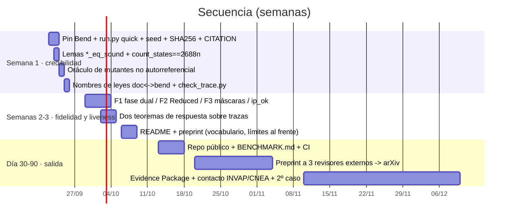

# Plan de mejoras — bend-spike / caso JET (2026-09-21)

Resultado de una auditoría con seis revisores independientes por perspectiva (fidelidad a [S1]/[S2]/[S6],
métodos formales, testing diferencial, seguridad funcional IEC 61508/61513, mercado, docs/reproducibilidad)
y cuatro diseñadores. Los 19 `PROOF*.bend` pasan en Bend **2.0.24** (re-chequeado hoy; el pin del repo sigue en 2.0.6).

## Veredicto

El **método** (leyes → certificado por cómputo + reflexión → testing diferencial contra la implementación) es sólido y
honesto en sus límites. El **caso** promete más de lo que entrega en dos frentes: fidelidad a JET (tres discrepancias
que un autor de [S1] objetaría) y reproducibilidad (un desconocido no reproduce en una hora). El activo vendible es
el método —*pruebas que no crecen con la configuración*—, no el caso JET ni Bend.

## Hallazgos que cambian el plan

| Área | Hallazgo | Sección |
|---|---|---|
| Fidelidad | JTT re-etiqueta la fase y `concretize` lee la fila `Termination`; protección local apaga el sistema entero (R-9 dice *un PINI*); CommFault/ciegas incondicionales (fuente: "*can* trigger", máscaras Level-1) | [01](01-fidelidad.md) |
| Formal | Sin lemas `*_eq_sound` (vector de vacuidad barato); sin liveness acotada sobre trazas; exhaustividad de la enumeración no probada; `step_c_is_the_concrete_step` es `{==}` | [02](02-formal.md) |
| Testing | Banco de mutantes autorreferencial (5/6 mutantes de constantes sobreviven); Hypothesis sin seed; `results.json` fuera del repo | [03](03-testing-repro.md) |
| Repro | `env/bend.sh` no pinea commit; `env/check_env.sh:27` usa `bend --version` (eliminado en 2.0.17: hoy falla en entorno limpio; es `bend version`); `run.py --help` lanza el gate de 6 min; sin `requirements`/`CITATION`/CI; 32/64 leyes con otro nombre en docs | [03](03-testing-repro.md) |
| Mercado | Ángulo único: verificación por configuración; puertas: labs I&C, startups DOE/NRC-fusión (INFUSE vía lab), INVAP/CNEA RA-10; artefacto: `BENCHMARK.md` + preprint cs.SE + Evidence Package | [04](04-mercado-artefactos.md) |

## Orden de ejecución

Regla de vocabulario para todo lo que se publique: *decidido por cómputo y elevado por reflexión* ≠ verificación
independiente; el caso JET es retrospectivo (máquina cerrada en 2023) y se presenta como el único dataset de
protección de máquina con V&V publicada.
