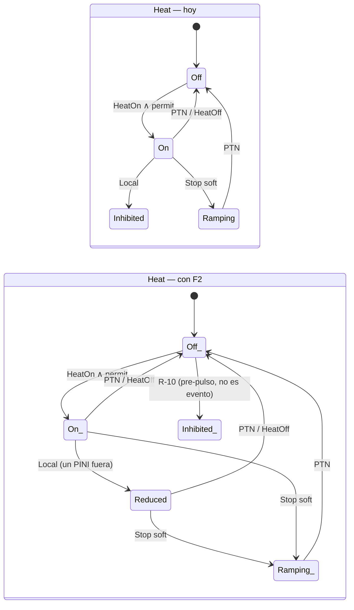

# 01 — Fidelidad a [S1]/[S2]/[S6]: diseño de F1, F2, F3 e `ip_ok`

Fecha: 2026-09-21. Estado: **diseño, no implementado**. Origen: auditoría de fidelidad (agente físico de
operaciones) sobre `v3/jetprot.bend` rev. actual. Bend 2.0.24: cada operador lleva su propio `( .. : T)`;
un `let` tipado se escribe `x : T = v`. Nombres de defs y leyes son los reales del `.bend`.

Resumen: el modelo transcribe bien la Tabla 1 y la secuencia DMS, pero en tres puntos afirma una política
**distinta** de la publicada sin declararla, y omite el único veredicto barato que cubre 7/16 disrupciones
perdidas de R-15. Las cuatro correcciones son locales (tipos + 4 defs + 9 leyes), el certificado crece
de 2 688 a **21 504** estados (×8), dentro de lo que el patrón seq3 ya soporta (209 664 celdas en C5).

---

## F1 — JTT no contamina la fila de la Tabla 1

**Problema.** `soft_apply` llama a `jtt_phase(req, p)` y escribe `Termination{}` en `Fin.phase`. Desde
entonces `concretize(i, p, XAlarm{t})` consulta `table(i, Termination, t)`: un `Slow` o `Mchs` posterior
en una descarga que estaba en Heating 2 mapea a PTN y (A-1: JTT < PTN) escala a parada dura. [S2] §3.4
describe exactamente esta trampa ("two views of time"): en JET la fase de la Tabla 1 es la **fase
temporizada de Level-1**, no la del waveform de terminación que el JTT dispara. Hoy el efecto no está
declarado en ninguna A-n.

**(a) Tipos.** `Fin` pasa a llevar dos fases; la tabla lee `prog`, el permisivo y la ventana DMS leen `wave`.

```bend
# fase de programa (Level-1, la que indexa la Tabla 1) y fase de onda (la que el JTT salta)
type Fin is Data:
  Fin{prog: Phase, wave: Phase, level: Level, dms: Dms, plasma: Bool, nb: Heat, rf: Heat}

def jtt_phase(req: Level, p: Phase) -> Phase:      # sin cambios: actúa sobre wave
  match req:
    case LJtt{}:
      Termination{}
    case _:
      p

def soft_apply(+req: Level, f: Fin) -> Fin:
  match f:
    case Fin{pg, pw, l, d, pl, nb, rf}:
      Fin{pg, jtt_phase(req, pw), req, d, pl, ramp(nb), ramp(rf)}

def concretize(i: Inst, f: Fin, c: CEv) -> Ev:       # recibe el Fin, no una Phase
  match c:
    case XAlarm{t}:
      +t2 = t
      +pg = prog_of(f)
      Stop{table(i, pg, t2), dms_req(dms_phase_of(f), t2)}
    ...
```

`Advance` avanza **ambas** (`prog` y `wave` en lockstep hasta que el JTT las separa); `wave` nunca
retrocede; `prog` sigue el reloj de Level-1 aunque el JTT haya saltado.

**(b) Leyes.**

```bend
# F1a: la fila de la tabla que usa un evento concreto es la fase de programa, nunca la de onda
law f1_table_reads_prog:
  for +i: S.Inst
  for +f: S.Fin
  for +t: S.Trig
  {S.stop_req_of(S.concretize(i, f, S.XAlarm{t})) == S.table(i, S.prog_of(f), t) : S.Level}

# F1b: un stop suave no mueve la fase de programa
law f1_soft_keeps_prog:
  for +o: S.Ord
  for +f: S.Fin
  for +req: S.Level
  {S.prog_of(S.soft_if(S.lvl_lt(o, S.level_of(f), req), req, f)) == S.prog_of(f) : S.Phase}

# F1c: wave >= prog siempre (invariante nuevo I7, va dentro de inv_fin)
law f1_wave_ahead:
  for +f: S.Fin
  for +h: {S.inv_fin(f) == True{} : Bool}
  {S.phase_le(S.prog_of(f), S.wave_of(f)) == True{} : Bool}
```

**(c) Certificado.** `wave` toma valores ≥ `prog`: 28 pares en vez de 7 fases → 2 688 × 4 = **10 752**
estados (no ×7, por I7).

**(d) Registro.** Nueva **A-24**: "la Tabla 1 se indexa por la fase de Level-1; el JTT mueve solo la
fase de onda ([S2] §3.4)". A-5 (orden total de fases) queda solo para `prog`. Ninguna A-n se retira.

```mermaid
flowchart LR
  subgraph antes["Hoy"]
    A1[Heating2] -->|JTT| A2[phase := Termination]
    A2 -->|Slow| A3["table(Termination, Slow) = PTN"]
    A3 --> A4[PTN: parada dura no publicada]
  end
  subgraph despues["Con F1"]
    B1["prog=Heating2 / wave=Heating2"] -->|JTT| B2["prog=Heating2 / wave=Termination"]
    B2 -->|Slow| B3["table(prog=Heating2, Slow) = JTT"]
    B3 --> B4[sigue el JTT: como [S1] Tabla 1]
  end
```

---

## F2 — Protección local reduce, no apaga

**Problema.** `local_fin` pone la unidad en `Inhibited{}` para el resto del pulso. R-9 ([S1] p.1295
"Local Protection"): se apaga *un PINI* "without the NB system as a whole having to stop delivering
power". El modelo hace lo contrario del concepto que el paper introduce.

**(a) Tipos.**

```bend
type Heat is Data:
  Off{}
  Inhibited{}      # se conserva para la vía R-10 (deshabilitado pre-pulso), ya no la usa Local
  Reduced{}        # potencia parcial: uno o más PINIs/antenas fuera, la unidad sigue entregando
  Ramping{}
  On{}

def reduce(u: Heat) -> Heat:
  match u:
    case On{}:
      Reduced{}
    case u2:
      u2               # Off/Inhibited/Ramping/Reduced no cambian

def local_fin(f: Fin, w: Who) -> Fin:
  match f w:
    case Fin{pg, pw, l, d, pl, nb, rf} Nb{}:
      Fin{pg, pw, l, d, pl, reduce(nb), rf}
    case Fin{pg, pw, l, d, pl, nb, rf} Rf{}:
      Fin{pg, pw, l, d, pl, nb, reduce(rf)}
```

`unit_rank`: `Off < Inhibited < Ramping < Reduced < On`. `ramp(Reduced) = Ramping`,
`deenergize(Reduced) = Off`, `turn_on(ok, Reduced) = Reduced` (una unidad reducida no vuelve a `On` sin
`Reset`; conservador, declarado).

**(b) Leyes.**

```bend
# F2a: Local nunca apaga ni inhibe una unidad que estaba entregando potencia
law f2_local_keeps_power:
  for +f: S.Fin
  for +w: S.Who
  {S.implies(S.is_on(S.unit_of(w, f)), S.is_reduced(S.unit_of(w, S.local_fin(f, w)))) == True{} : Bool}

# F2b: Local no toca la otra unidad ni el nivel (marco; reemplaza el brazo Local de p9)
law f2_local_frame:
  for +f: S.Fin
  for +w: S.Who
  {S.fin_eq_except_unit(w, f, S.local_fin(f, w)) == True{} : Bool}

# F2c: una unidad reducida sigue obedeciendo a las paradas (Ramping bajo RTPS, Off bajo PTN)
law f2_reduced_still_stops:
  for +o: S.Ord
  for +f: S.Fin
  for +e: S.Ev
  for +bt: Bool
  for +bh: Bool
  {S.pr_stop_no_full_power(S.step_fin(o, f, e, bt, bh)) == True{} : Bool}
```

**(c) Certificado.** `Heat` pasa de 4 a 5 valores en dos unidades: ×(25/16) → sobre F1: **16 800**.

**(d) Registro.** A-6 se reescribe ("una unidad = un sistema con potencia total o parcial"); A-9 agrega
la fila `Reduced`. Cita: [S1] p.1295, "Local Protection". `stop_no_full_power` y
`termination_no_full_power` siguen válidos (`Reduced` no es `On`).



---

## F3 — CommFault y alarmas ciegas pasan por máscaras

**Problema.** `step_fin` trata `CommFault{dms}` como `arm_if(dms, to_ptn(f))`: PTN incondicional. [S1]
p.1296 "Ensuring Reliability": la pérdida de comunicación "**can** trigger the PTN" y "features or
subsystems not in use cannot cause problems" — Level-1 condiciona esos chequeos. Es exactamente la
franja donde [S6] reporta 5 disrupciones perdidas por "inhibits" (R-15). Las alarmas ciegas son alarmas
del VTM que **pasan por la tabla**, no una vía directa.

**(a) Tipos.** Las máscaras son configuración (carga del `Inst`, como la matriz), no estado.

```bend
type Mask is Data:
  Mask{comm: Bool, blind: Bool}       # True = el chequeo está habilitado en este pulso

def mask_of(i: Inst) -> Mask: ...     # Inst1: ambas True (como hoy); Inst2: idem; Inst3: comm False

def comm_fin(m: Mask, f: Fin, d: Bool) -> Fin:
  match m:
    case Mask{c, b}:
      match c:
        case True{}:
          arm_if(d, to_ptn(f))
        case False{}:
          f
```

En `step_fin`, `case CommFault{dms}: comm_fin(mask_of(i), f, dms)` — `step_fin` gana el parámetro `i`
(o la `Mask` se pasa como carga, igual que `Ord`). Alarma ciega: nuevo `Trig.Blind{}` que entra por
`table(i, prog, Blind)` como cualquier disparador (R-2 + p.1296).

**(b) Leyes.**

```bend
# F3a: chequeo habilitado ⇒ CommFault lleva a PTN (lo que hoy vale incondicionalmente)
law f3_comm_enabled_trips:
  for +f: S.Fin
  for +d: Bool
  {S.is_ptn(S.level_of(S.comm_fin(S.Mask{True{}, True{}}, f, d))) == True{} : Bool}

# F3b: chequeo deshabilitado ⇒ CommFault es identidad (la ley que certifica la configuración A-21)
law f3_comm_masked_is_noop:
  for +f: S.Fin
  for +d: Bool
  for +b: Bool
  {S.fin_eq(S.comm_fin(S.Mask{False{}, b}, f, d), f) == True{} : Bool}

# F3c (conformidad): la instancia publicada tiene ambos chequeos habilitados
law f3_inst1_all_checks_on:
  {S.mask_of(S.Inst1{}) == S.Mask{True{}, True{}} : S.Mask}
```

**(c) Certificado.** Sin estado nuevo; la máscara multiplica las **instancias** (2 → 4 combinaciones
útiles), no las celdas por instancia. Costo: ×2 en C1/C5 de conformidad.

**(d) Registro.** A-21 deja de ser "sin bypass" y pasa a "bypass modelado solo para comm/blind; entradas
y salidas del PTN (R-10) siguen fuera". Nueva **A-25**: "una alarma ciega es un disparador de la tabla".
Cita: [S1] p.1296.

---

## `ip_ok` — umbral de corriente del DMV (A-22)

**Problema.** R-14/[S6]: el DMV solo se habilita con `Ip` sobre umbral; 7 de las 16 disrupciones
perdidas de R-15 son de este tipo. Hoy `dms_req` depende solo de la ventana por fase.

**(a) Tipos.** Un `Bool` en `Fin`, actualizado por un evento nuevo, exactamente como `plasma`.

```bend
type Fin is Data:
  Fin{prog: Phase, wave: Phase, level: Level, dms: Dms, plasma: Bool, ip_ok: Bool, nb: Heat, rf: Heat}

type Ev is Data:
  ...
  Ip{ok: Bool}                         # el veredicto Ip >= umbral, como Plasma{ok}

def dms_req(p: Phase, ip: Bool, t: Trig) -> Bool:
  Bool.and(dms_window(p), Bool.and(ip, dms_trig(t)))
```

**(b) Leyes.**

```bend
# IP1: sin corriente suficiente el DMS nunca se arma, cualquiera sea la fase y el disparador
law ip_low_never_arms:
  for +o: S.Ord
  for +f: S.Fin
  for +e: S.Ev
  for +bt: Bool
  for +bh: Bool
  for +h: {S.ip_ok_of(f) == False{} : Bool}
  {S.implies(S.is_idle(S.dms_of(f)), S.is_idle(S.dms_of(S.step_fin(o, f, e, bt, bh)))) == True{} : Bool}

# IP2 (demanda): con corriente, ventana y disparador DMS, la alarma arma en el mismo paso
law ip_ok_arms_on_demand:
  for +i: S.Inst
  for +f: S.Fin
  for +t: S.Trig
  for +h: {Bool.and(S.ip_ok_of(f), Bool.and(S.dms_window(S.wave_of(f)), S.dms_trig(t))) == True{} : Bool}
  {S.is_armed(S.dms_of(S.step_c(i, S.St{f, 0n, 0n}, S.XAlarm{t}))) == True{} : Bool}
```

**(c) Certificado.** ×2 → sobre F1+F2: **33 600**. Si se quiere contener, `ip_ok` puede ir como carga del
evento `XAlarm` (veredicto, sin estado): certificado ×1, pero se pierde IP1 como invariante de estado.
Recomendación: estado (es lo que el operador configura y lo que [S6] audita).

**(d) Registro.** A-22 se retira; entra **R-14 modelado**. Cita: [S6] §3 (ventana + umbral del DMV),
[S2] §3.3.

---

## Orden y presupuesto

| Ítem | Archivos | Esfuerzo | Riesgo | Estados | Qué destraba |
|---|---|---|---|---|---|
| F1 fase dual | `jetprot.bend` (Fin, soft_apply, concretize, advance), `enum_jetprot.bend`, 3 leyes, pymodel | 1 día | medio: toca `concretize`, 17/62 mutantes dependen de C1 → re-medir | 10 752 | Lo que un autor de [S2] objeta primero |
| F2 `Reduced` | `jetprot.bend` (Heat, local_fin, ranks), 3 leyes, pymodel, mutantes | ½ día | bajo | ×1.56 | Coherencia con R-9; el paper deja de ser negado |
| F3 máscaras | `jetprot.bend` (Mask, comm_fin, Trig.Blind), `Inst3`, 3 leyes, C1/C5 ×2 | ½ día | bajo | ×1 (×2 instancias) | Certificar configuración = el argumento A-21 |
| `ip_ok` | `jetprot.bend` (Fin, Ev.Ip, dms_req), 2 leyes, pymodel | ½ día | bajo | ×2 | 7/16 misses de R-15 |
| Total | — | 2.5 días + 1 día de re-pruebas (PROOF_*: certificados ×12.5, ~30 min checker JS) | — | **33 600** | Encuadre honesto: "el Stop Selector según [S1]/[S2]", no "una política inspirada" |

Orden: F2 → `ip_ok` → F3 → F1 (F1 al final porque cambia la firma de `concretize` y obliga a re-medir el
banco de mutantes; los otros tres son aditivos). Cada ítem cierra con `All terms check.` en
`PROOF_JETPROT.bend` y `py -3.14 v3/run.py` en verde antes del siguiente.

Fuera de alcance de este documento (otros forks): leyes `*_eq_sound`, liveness sobre trazas,
oráculo de mutantes, reproducibilidad.
