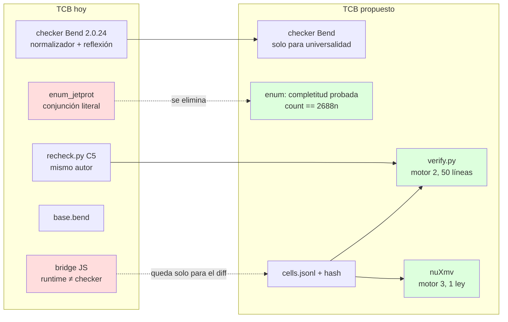
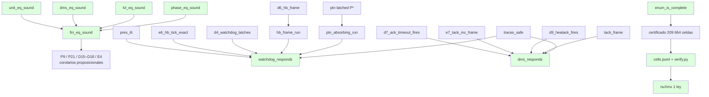

# 02 — Garantías formales: soundness, respuesta sobre trazas, exhaustividad, certificado exportable

Fecha: 2026-09-21. Base: `v3/jetprot.bend`, `v3/LAWS_JETPROT.bend`, `v3/enum_jetprot.bend` (Bend 2.0.24). Origen: auditoría de métodos formales (hallazgos Q1–Q4 en `project-bend-spike`). Nada de esto cambia el modelo; agrega leyes y artefactos alrededor.

## 0. Qué se cierra

| Hueco | Síntoma | Cierre |
|---|---|---|
| Igualdades booleanas sin puente proposicional | `fin_eq`, `unit_eq`, `lvl_le` son código del modelo; un `unit_eq` que confunda `Off`/`Inhibited` vacía P9/P21/D15–D18/E4 sin que Bend lo vea | §1: lemas `*_sound` |
| Sin respuesta sobre trazas | `traces_safe` es invariante; nadie prueba "watchdog ⇒ PTN en ≤ hb_max ticks" | §2: dos teoremas de respuesta acotada |
| Enumeración no probada exhaustiva | `all_level` es una conjunción literal; un constructor omitido pasa en silencio | §3: `count_states == 2688n` + `match` total |
| Certificado atado al checker de Bend | TCB = normalizador 2.0.24 sin metateoría publicada | §4: celdas exportadas + verificador externo + cross-check nuXmv |

## 1. Lemas de soundness (≤ 1 h cada uno)

Patrón del cookbook §3.4 ("verdict splits"): la hipótesis es `f(a,b) == True{}`; se hace `match a b:` sobre todos los pares; los brazos diagonales cierran con `{==}`; los brazos fuera de la diagonal tienen hipótesis `False{} == True{}` y se refutan con `Empty.absurd` vía un lema `Bool.false_ne_true`. Ninguno necesita inducción.

```bend
# LAWS_JETPROT_SOUND.bend
import Base
import ./jetprot.bend as S

# unit_eq es la igualdad de Heat (4x4 = 16 brazos, 4 diagonales por {==})
law unit_eq_sound:
  for +a: S.Heat
  for +b: S.Heat
  for -h: {S.unit_eq(a, b) == True{} : Bool}
  {a == b : S.Heat}

law dms_eq_sound:
  for +a: S.Dms
  for +b: S.Dms
  for -h: {S.dms_eq(a, b) == True{} : Bool}
  {a == b : S.Dms}

law lvl_eq_sound:
  for +a: S.Level
  for +b: S.Level
  for -h: {S.lvl_eq(a, b) == True{} : Bool}
  {a == b : S.Level}

law phase_eq_sound:   # 7x7 = 49 brazos: generar con script, no a mano
  for +a: S.Phase
  for +b: S.Phase
  for -h: {S.phase_eq(a, b) == True{} : Bool}
  {a == b : S.Phase}

# fin_eq descompone en las seis anteriores (Bool.and_elim_l/r del kit §8)
law fin_eq_sound:
  for +a: S.Fin
  for +b: S.Fin
  for -h: {S.fin_eq(a, b) == True{} : Bool}
  {a == b : S.Fin}

# lvl_le es un orden total por Ord: reflexivo, antisimétrico, transitivo
law lvl_le_refl:
  for +o: S.Ord
  for +a: S.Level
  {S.lvl_le(o, a, a) == True{} : Bool}

law lvl_le_antisym:
  for +o: S.Ord
  for +a: S.Level
  for +b: S.Level
  for -h1: {S.lvl_le(o, a, b) == True{} : Bool}
  for -h2: {S.lvl_le(o, b, a) == True{} : Bool}
  {a == b : S.Level}
```

Esquema de prueba (uno; los demás son copias):

```bend
def unit_eq_sound(a: S.Heat, b: S.Heat, -h: {S.unit_eq(a, b) == True{} : Bool}) -> {a == b : S.Heat}:
  match a b:
    case S.Off{} S.Off{}:            {==}
    case S.Off{} S.Inhibited{}:      Empty.absurd(false_ne_true(h))   # h : {False{} == True{} : Bool}
    ...                              # 16 brazos; los 4 diagonales son {==}
```

`false_ne_true` (kit §8): `def false_ne_true(-e: {False{} == True{} : Bool}) -> Empty` por `match` sobre la ecuación con un predicado que distingue constructores (cookbook §3.6 "refutación").

Nota 2.0.24: como `unit_eq` pasa por `Nat.is_eq(unit_rank(a), unit_rank(b))`, el checker reduce `unit_rank(Off{})` a `0n` por cómputo; los brazos cierran sin lemas de `Nat`. `fin_eq` necesita descomponer `Bool.and(x, y) == True{}` en `x == True{}` y `y == True{}`: dos lemas de 4 líneas.

**Efecto:** cada ley de marco que hoy concluye `S.fin_eq(f, f2) == True{}` gana un corolario proposicional `f == f2` gratis (`Equal.trans` con el lema). El mutante "unit_eq confunde Off/Inhibited" pasa a fallar en Bend, no solo en C5 Python.

## 2. Teoremas de respuesta sobre trazas (½ día cada uno)

**Estado (2026-09-21): hecho, bloqueante 5** (`docs/STATUS_2026-09-21.md` §4.5). Diferencias con lo de abajo: las
hipótesis van con `+` (se usan dos veces), la cota se escribe `Nat.is_le(S.hb_max(), ticks(trace))`, los hechos que
usa la inducción son `step_safe` + P1, D4 (watchdog) y D7, D8, P15, P18, E11 (DMS), no E6/D6/E8, y no son leyes
abiertas sino hipótesis template del core (Bend rechaza código vivo que llame a una ley sin llenar).

Hoy: `traces_safe` (invariante para toda traza). Falta: *algo pasa* dentro de una cota. Sin liveness infinita (Bend no tiene ◇), pero la respuesta **acotada** es un invariante sobre trazas de largo fijo y se prueba por inducción en la traza.

### 2.1 Watchdog: `hb_max` ticks sin heartbeat ⇒ PTN enclavado

```bend
# una traza de n eventos que no contiene Heartbeat ni Reset (predicado decidible)
def no_hb(trace: List<&2, S.Ev>) -> Bool: ...        # List.all sobre is_heartbeat/is_reset negados
def ticks(trace: List<&2, S.Ev>) -> Nat: ...          # cuenta Tick

law watchdog_responds:
  for +o: S.Ord
  for +s: S.St
  for -h_inv: {S.inv_all(s) == True{} : Bool}
  for +trace: List<&2, S.Ev>
  for -h_nohb: {no_hb(trace) == True{} : Bool}
  for -h_len: {Nat.is_ge(ticks(trace), S.hb_max()) == True{} : Bool}
  {S.is_ptn(S.level_of(S.fin_of(S.run_o(o, trace, s)))) == True{} : Bool}
```

Esquema inductivo sobre `trace` con un invariante fortalecido `hb_of(s) + ticks(resto) >= hb_max ∨ is_ptn`:
- caso `[]`: `ticks = 0`, la hipótesis obliga `hb_max <= hb`; con **I6** (`hb <= hb_max` mientras no PTN) e **E6** (`hb == hb_max ⇒` el próximo Tick enclava)... el caso vacío exige que ya sea PTN: se cierra con I6 + `Nat` antisimetría.
- caso `Tick :: rest`: **E6** (`e6_hb_tick_exact`: Tick sin heartbeat incrementa `hb` exactamente o enclava) + **D4** (`d4_watchdog_latches`: `hb == hb_max` ⇒ `is_ptn` tras el paso) + hipótesis inductiva sobre `rest` con `hb+1`.
- caso otro evento sin heartbeat: **D6** (`d6_hb_frame`: `hb` no baja) + I.H.
- `is_ptn` es absorbente: reutiliza `pres_i*` de nivel (PTN nunca baja: ley P existente `ptn_latched`).

Lemas nuevos: `hb_frame_run` (por inducción, `hb` no decrece sin heartbeat), `ptn_absorbing_run` (una vez PTN, `run_o` lo conserva). Los `for +` sobre `s` y `o` porque la I.H. los reutiliza; las hipótesis `-h` se usan una vez cada una por brazo (si hace falta dos veces: `+h`, y `Bool` es `Data`).

### 2.2 DMS: armado ⇒ `Fired` en ≤ `ack_max` ticks

```bend
law dms_responds:
  for +o: S.Ord
  for +s: S.St
  for -h_inv: {S.inv_all(s) == True{} : Bool}
  for -h_armed: {S.is_armed(S.dms_of(S.fin_of(s))) == True{} : Bool}
  for +trace: List<&2, S.Ev>
  for -h_noreset: {no_reset(trace) == True{} : Bool}
  for -h_len: {Nat.is_ge(ticks(trace), S.ack_max()) == True{} : Bool}
  {S.is_fired(S.dms_of(S.fin_of(S.run_o(o, trace, s)))) == True{} : Bool}
```

Reutiliza **D7** (`d7_ack_timeout_fires`), **D8/E7** (`tack` cuenta exactamente), **D9/E11** (HeatAck dispara antes) y `tack_frame`. Misma forma que 2.1; el invariante fortalecido es `tack + ticks(resto) >= ack_max ∨ is_fired`. Ambos teoremas son **universales en `hb_max`/`ack_max`**: no consultan el certificado; valen si mañana `hb_max = 25`.

## 3. Exhaustividad de la enumeración (2 h)

```bend
# enum_jetprot.bend
def count_fin() -> Nat: ...      # plegado de la misma pirámide all_* con Nat.add en vez de Bool.and
law enum_is_complete:
  {count_fin() == 2688n : Nat}   # 7·4·3·2·4·4 — cierra por cómputo, {==}

# all_level con match total: un constructor omitido es un error de tipos, no un silencio
def all_level(+o: S.Ord, +p: S.Phase) -> Bool:
  fold_level(o, p, S.LNone{}) ...   # o: def each_level(k: Level -> Bool) -> Bool con match sobre un Level "testigo"
```

La forma robusta: un `def levels() -> List<&2, S.Level>` con una ley `levels_complete: for +l: S.Level {List.contains(levels(), l) == True{}}` probada por `match l:` (4 brazos `{==}`). Idem `phases()`, `dmss()`, `heats()`. Entonces `check_fin` es `List.all` sobre el producto y la completitud es un teorema, no una convención.

## 4. Certificado exportable y cross-check externo (1 día)

**Esquema JSON de celda** (`v3/certificate/cells.jsonl`, una línea por celda, 2 órdenes × 104 832):

```json
{"ord":"Ord1","fin":{"phase":"Heating2","level":"LNone","dms":"DmsIdle","plasma":true,"nb":"On","rf":"On"},
 "ev":"Stop","bt":false,"bh":true,"fin2":{...},"props":{"g_a":true,"g_b":true,"g_c":true,"g_d":true,"g_e":true}}
```

`v3/certificate/MANIFEST.json`: `{"bend":"2.0.24","commit":"e52cda4","jetprot_sha256":..., "cells_sha256":..., "count":209664}`.

**Verificador externo** (`v3/certificate/verify.py`, ~50 líneas): recorre `cells.jsonl`, recalcula `fin2` con `pymodel/jetprot_ref.py::step_fin` y las 5 props con una transcripción independiente de `prop_at`, exige 209 664 líneas y todas `true`, y compara el hash. **No confía en Bend**: es la misma evidencia decidida por un segundo motor (ya casi existe en `recheck.py::c5`; falta el formato y el hash).

**Cross-check nuXmv de una ley** (`v3/certificate/jetprot.smv`, generado desde `jetprot_ref.py`): el módulo tiene los 6 campos de `Fin` + `hb`, `tack` acotados a `0..hb_max`; `INVARSPEC` con `d4_watchdog_latches` traducida y `LTLSPEC G (hb = hb_max & !heartbeat -> X is_ptn)`. Qué prueba: que un model checker independiente, con semántica propia, acepta la misma propiedad sobre la misma tabla. Qué no prueba: universalidad en `hb_max` (nuXmv lo fija) — eso queda en Bend, y esa es la división de trabajo a explicar en el preprint.

## 5. TCB antes / después



## 6. Dependencias entre leyes nuevas y existentes



## 7. Esfuerzo / credibilidad

| Ítem | Esfuerzo | Riesgo | Qué gana en credibilidad |
|---|---|---|---|
| `*_eq_sound` (5 lemas) + `lvl_le` orden | 2–3 h (49 brazos de `phase_eq` por script) | bajo | Cierra el vector de vacuidad más barato; las leyes de marco pasan a ser proposicionales |
| `watchdog_responds` | ½ día | medio: la inducción exige el invariante fortalecido; agente bend-prover por lema | Primer resultado de *respuesta*; universal en `hb_max` |
| `dms_responds` | ½ día (copia del anterior) | medio | Idem para el DMS |
| `enum_is_complete` + listas completas | 2 h | bajo | La exhaustividad deja de ser convención |
| `cells.jsonl` + `verify.py` + MANIFEST | ½ día | bajo | Evidencia auditable sin confiar en Bend; reproducible con hash |
| nuXmv 1 ley | 1 día (traducción a mano) | medio: semántica de contadores | Tercer motor independiente; responde "¿y si el checker miente?" |

Orden recomendado: soundness → exhaustividad → exportación → respuesta → nuXmv. Los tres primeros no tocan pruebas existentes; los PROOF actuales siguen pasando (verificado en 2.0.24, 19/19).
