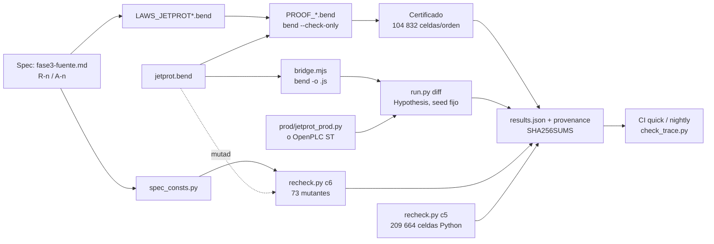
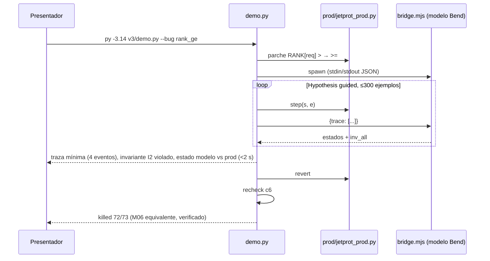

# 03 — Testing diferencial y reproducibilidad: diseño de mejoras

Fecha: 2026-09-21. Origen: auditoría de 6 agentes (simulación/testing, docs/preprint). Estado: **diseño, no aplicado**.
Nombres de archivo y función son los reales del repo (`v3/run.py`, `v3/recheck.py`, `v3/pymodel/mutants.py`,
`env/bend.sh`, `env/check_env.sh`).

## 0. Diagnóstico en una línea por ítem

| # | Problema hoy | Evidencia |
|---|---|---|
| 1 | El banco de mutantes es **autorreferencial**: `recheck.c6` restaura 13 nombres de `ORIG` y las leyes se evalúan con las constantes del modelo mutado | 5/6 mutantes de constantes sobreviven (`HB_MAX=4`, `ACK_MAX=3`, `INIT plasma=True`, `INIT en IpRise`, `heat_win ∋ Xpoint`) |
| 2 | `results.json` **no es reproducible ni auditable** | `hypothesis.find` sin seed; sin versiones/hashes; el archivo está en `.gitignore` y el README cita sus números |
| 3 | `v3/run.py` no tiene CLI: `--help` lanza el gate de 5–6 min | `main()` sin `argparse` |
| 4 | Bend no está pineado: `env/bend.sh` clona `--depth 1` de `main` | hoy trae 2.0.24; el spike se corrió en 2.0.6 (pasa igual, verificado 2026-09-21) |
| 5 | Trazabilidad rota en nombres: 32/64 leyes con nombre distinto en docs, 8 ausentes | `fase3-trazabilidad.md` vs `LAWS_JETPROT.bend` |
| 6 | Sin CI, sin tag, sin `CITATION.cff`, sin `requirements.txt` | `git log`: 2 commits |
| 7 | Sin demo corta ni camino a un target real | la primera salida útil tarda 5 min |

## 1. Oráculo de mutantes no autorreferencial

**Diseño.** Las constantes de especificación salen del modelo y viven en `v3/pymodel/spec_consts.py`, que
importan **solo las leyes** (`catching_laws`, `inv_all`, C1–C5). `jetprot_ref.py` sigue teniendo sus copias
(son "el modelo"); un mutante que las cambie ya no arrastra al oráculo.

```python
# v3/pymodel/spec_consts.py  — lo que la spec fija; NUNCA importado por jetprot_ref.step_*
HB_MAX, ACK_MAX = 3, 2                       # A-11, A-13 (ver 01-fidelidad para valores reales)
PHASES = ["Breakdown", "IpRise", "Limiter", "Xpoint", "Heating1", "Heating2", "Termination"]  # R-1
RANK = {1: {"LNone": 0, "LJtt": 1, "LRtps": 2, "LPtn": 3}, 2: {"LNone": 0, "LJtt": 2, "LRtps": 1, "LPtn": 3}}
INIT = ("Breakdown", "LNone", "DmsIdle", False, "Off", "Off")                                 # R-5
DMS_WINDOW = {"Xpoint", "Heating1", "Heating2", "Termination"}                                # R-13 / [S6]
HEAT_WIN = {"Heating1", "Heating2"}                                                           # A-6
```

`recheck.c6`: extender `ORIG` a **todo** símbolo público de `R` (`{k: getattr(R,k) for k in dir(R) if not k.startswith("_")}`)
y restaurar por `vars(R).update(ORIG)`; así un mutante puede tocar constantes y funciones por igual.

**Mutantes nuevos (11).** Convención `M63_…`, plausibilidad 1–5, `patch()` devuelve `{nombre: valor}`:

| Nombre | Qué muta (`jetprot_ref.py`) | Ley que debería atraparlo |
|---|---|---|
| `M63_hb_max_4` | `HB_MAX = 4` | I6/E6 con `spec_consts.HB_MAX` (hoy sobrevive) |
| `M64_ack_max_3` | `ACK_MAX = 3` | D4/E5 (hoy sobrevive) |
| `M65_init_plasma_true` | `INIT[3] = True` | nueva `init_is_spec` (`step_st` desde `INIT` ≡ spec) |
| `M66_init_iprise` | `INIT[0] = "IpRise"` | `init_is_spec` |
| `M67_heat_win_xpoint` | `HEAT_WIN ∋ "Xpoint"` en `step_fin` (HeatOn) | D15/P9 con `spec_consts.HEAT_WIN` |
| `M68_dms_window_no_term` | `DMS_WINDOW − {"Termination"}` | D9 (`heatack_fires`) en Termination |
| `M69_rank2_jtt_ge_rtps` | `RANK[2]["LJtt"] = 1` (empate) | P2/orden total (`lvl_le_sound`, ver 02-formal) |
| `M70_heatack_ignored_in_term` | `step_c` ignora `XHeatAck` si `phase == Termination` | D9 |
| `M71_reset_fired_needs_plasma_false` | `reset_ok`: `DmsFired` aceptado solo si `plasma == False` | D10/E8 (guarda deletreada contra `spec_consts`) |
| `M72_inv_all_hb_le` | `inv_all`: `hb <= HB_MAX` (mutar el oráculo) | meta-test: `inv_all` de spec vs de modelo deben coincidir en 2688×39 celdas |
| `M73_c1_only_dep` | `concretize` correcto pero `table` con una celda cambiada | C1 **y** al menos otra ley (mide la dependencia 17/62 de C1) |

Meta-métrica nueva en `results["C6"]`: `laws_per_kill` (histograma) — cuántas leyes atrapan cada mutante;
un mutante atrapado por una sola ley es un punto débil a documentar.

## 2. Reproducibilidad de la evidencia

- `run.diff`: `settings(max_examples=MAX_EXAMPLES, database=None, deadline=None, derandomize=True)` **o**
  `seed = int(os.environ.get("BS_SEED", 20260921))` + `@seed(seed)`; el seed va al JSON.
- Bloque `provenance` en `results.json` (escrito por `run.main` antes de cualquier gate):

```json
"provenance": {
  "timestamp_utc": "2026-09-21T18:40:00Z",
  "bend": {"version": "2.0.24", "commit": "e52cda4", "src": "~/.bend-src"},
  "bun": "1.x", "node": "22.22.2", "python": "3.14.3", "hypothesis": "6.168.0",
  "seed": 20260921, "max_examples": 3000,
  "sha256": {"v3/jetprot.bend": "…", "v3/enum_jetprot.bend": "…", "v3/LAWS_JETPROT.bend": "…",
             "v3/LAWS_JETPROT_CONF.bend": "…", "v3/PROOF_JETPROT.bend": "…",
             "v3/pymodel/jetprot_ref.py": "…", "v3/prod/jetprot_prod.py": "…", "v3/bridge.mjs": "…"},
  "host": {"os": "Windows 11 10.0.26200", "cpu": "…"}
}
```

- Sacar `results.json` y `recheck.json` de `.gitignore`; commitearlos como **referencia** junto a `SHA256SUMS`
  (`sha256sum v3/results.json v3/recheck.json v3/*.bend > SHA256SUMS`). Un tercero corre `run.py all` y
  compara: mismos `gates`, mismos `killed/total`, mismas trazas mínimas (por el seed), mismo hash de celdas.
- `requirements.txt`: `hypothesis==6.168.0`, `jax[cpu]==<pin>` (solo `heat/`), `numpy==<pin>`.
- `CITATION.cff` (`cff-version: 1.2.0`, título del preprint, `type: software`, `license: Apache-2.0`,
  autor humano + nota de autoría IA en `abstract`).

## 3. `v3/run.py` con CLI

```
py -3.14 v3/run.py quick      # ~45 s: CONF (PROOF_JETPROT_CONF) + 1 negativo + diff guided 200 ejemplos + provenance
py -3.14 v3/run.py proofs     # ~150 s (2.0.24, checker JS): PROOF_JETPROT + CONF + 10 negativos
py -3.14 v3/run.py diff       # ~60–120 s: 32 corridas × 3000 ejemplos, seed fijo
py -3.14 v3/run.py mutants    # ~90 s: recheck C6 con banco extendido (73)
py -3.14 v3/run.py recheck    # ~60 s: C2 vacuidad, C3, C5 (209 664 celdas)
py -3.14 v3/run.py all        # ~6 min: todo + results.json + SHA256SUMS
py -3.14 v3/run.py demo       # ver §7
```

`argparse` con `subparsers`; `--seed`, `--max-examples`, `--json <path>`; `--help` imprime la tabla de tiempos.
Cada subcomando escribe su parte de `results` y `all` las une. `quick` es el gate de CI en cada push.

## 4. Pin de Bend y migración

- `env/bend.sh`: `BEND_COMMIT=e52cda4f…` (2.0.24, verificado hoy: 19/19 PROOF pasan); tras clonar,
  `git -C "$SRC" fetch --depth 200 origin && git -C "$SRC" checkout -q "$BEND_COMMIT"`. `--update` pasa a
  `--update <commit>` y reescribe el pin en el propio script.
- `env/check_env.sh`: `check "bend version" "bend 2.0.24"` (la línea 27 usa `--version`, que 2.0.17 eliminó →
  hoy da FAIL) y `check "bend commit" "$BEND_COMMIT" "$(git -C "$SRC" rev-parse HEAD)"` con **exit ≠ 0** si difiere.
  Reemplazar `py -3.14` por `${PY:-py -3.14}` para Linux/macOS (`PY=python3.14`).
- Estrategia: migrar el pin a 2.0.24 **ahora** (nada rompe; los operadores ya llevaban `( .. : T)`), y
  volver a pinear solo en releases con `Breaking:` en `CHANGELOG.md`.

## 5. `docs/check_trace.py` (trazabilidad doc ↔ `.bend`)

Extrae `law <nombre>` de `v3/LAWS_JETPROT*.bend` y todo token `[a-z][a-z0-9_]{6,}` con forma de ley de
`fase3-trazabilidad.md` y `fase3-diseno.md`; imprime tres listas: leyes sin fila en docs, nombres en docs sin
ley, y R-n/A-n/H-n/SR-n citados sin definición (`fase3-fuente.md`, `fase3-seguridad.md`). Exit = número de
huérfanos; corre en `quick`. Primer arreglo: renombrar en docs a `d1_stop_honoured`…`e11_…` y agregar las 8 ausentes.

## 6. CI (GitHub Actions, Linux, sin clang)

```yaml
on: [push, pull_request, schedule: {cron: "0 3 * * *"}]
jobs:
  quick:  {runs-on: ubuntu-latest, steps: [checkout, setup-python 3.14, oven-sh/setup-bun, node 22,
           "bash env/bend.sh version", "pip install -r requirements.txt", "python v3/run.py quick",
           "python docs/check_trace.py"]}
  nightly: {if: schedule, timeout-minutes: 30, steps: [..., "python v3/run.py all", "sha256sum -c SHA256SUMS"]}
```

Badge en README; `all` nightly compara contra los `results.json` commiteados y falla si `killed/total` baja.

## 7. Demo de 3 minutos y camino a PLC

`v3/demo.py`: (1) muestra `prod/jetprot_prod.py:RANK`; (2) aplica un parche elegido por flag
(`--bug rank_ge | window | reset`), (3) corre `diff --guided --max-examples 300` y en <2 s imprime la traza
mínima shrinkeada, el invariante Bend violado y el estado final lado a lado (modelo vs prod); (4) revierte y
cierra con `mutants` mostrando `killed/total`. Sin gates de pruebas (ya están en `results.json` con hash).

Camino a un target real, del más barato al más caro: (a) generar **IEC 61131-3 ST** desde `jetprot_ref.step_fin`
(tabla pura → `CASE`), correrlo en OpenPLC y alimentar `run.diff` por Modbus (solo cambia `prod.run`);
(b) `bend -o jetprot.c` + harness CFFI (necesita clang; no en esta máquina); (c) Stateflow (licencia).

## Diagramas





## Esfuerzo / impacto

| Ítem | Esfuerzo | Impacto | Riesgo |
|---|---|---|---|
| 1 `spec_consts.py` + `ORIG` total + 11 mutantes | 3 h | Alto: el 61/62 pasa a ser un número defendible | Puede bajar el score publicado (bien: es el real) |
| 2 seed + provenance + commitear results + SHA256SUMS + requirements + CITATION | 1.5 h | Alto: reviewer-killer #1 resuelto | Ninguno |
| 3 CLI `run.py` con `quick` | 1.5 h | Alto: "try in 60 s" posible | Ninguno |
| 4 pin de Bend + `check_env` duro + `PY` portable | 40 min | Alto | `--version` hoy FAIL: arreglar primero |
| 5 `check_trace.py` + renombrar en docs | 1.5 h | Medio: trazabilidad auditable | Ninguno |
| 6 CI quick/nightly + badge | 1 h | Medio | Runner sin clang: solo lane JS (declararlo) |
| 7 `demo.py` | 2 h | Alto para ventas; nulo para credibilidad | — |
| 7b ST/OpenPLC | 2–3 días | Alto: primer target "real" | Mapping estado↔registros, eventos perdidos |
