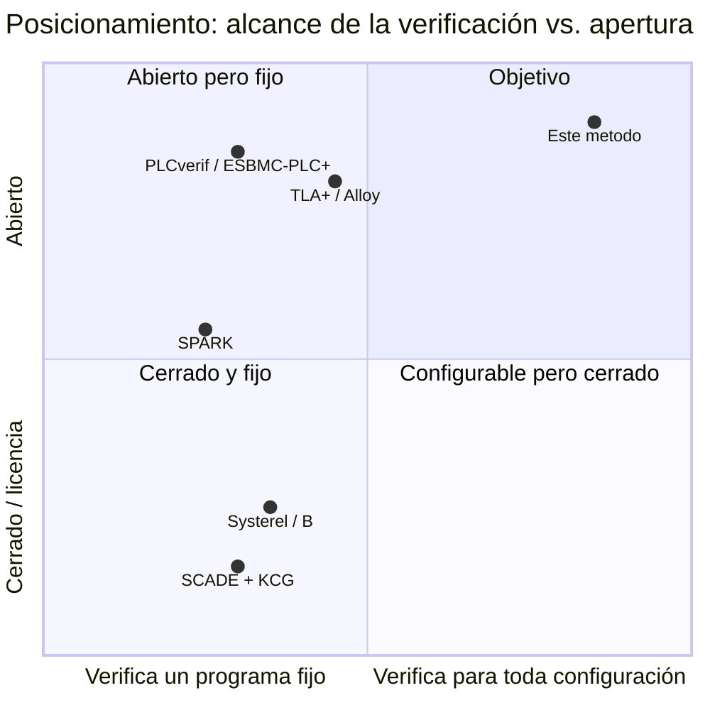
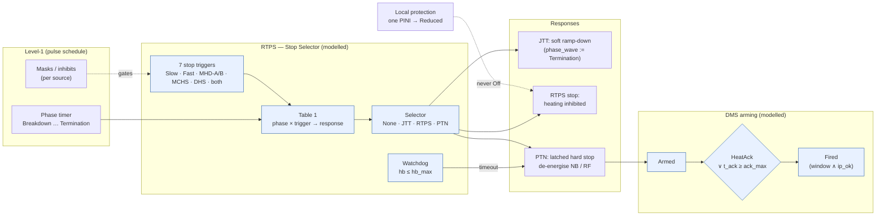
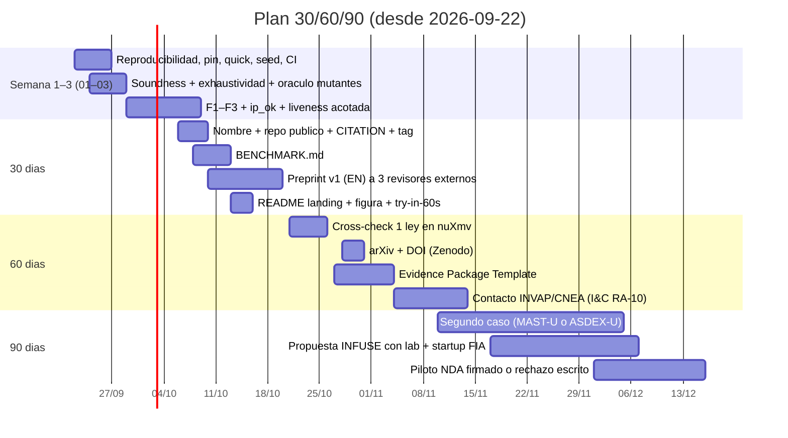

# 04 — Mercado y artefactos: qué mostrar, a quién, y en qué orden

Fecha: 2026-09-21. Insumo: auditoría de seis perspectivas (fidelidad, formal, testing, seguridad funcional, mercado, docs).
Alcance: posicionamiento, benchmark público, preprint, Evidence Package, README y plan 30/60/90. No toca el modelo (ver 01–03).

## 1. Posicionamiento

**Una frase.** *Modelos de referencia de lógica de protección cuyas leyes se prueban para toda traza y toda configuración, re-certificables en minutos cuando cambia la matriz — abiertos (Apache 2.0) y auditables sin confiar en el verificador.*

**Ángulo único: "pruebas que no crecen con la configuración".** La matriz fase × disparador → respuesta viaja como carga del evento; las 64 leyes valen para *toda* matriz, y una configuración nueva se certifica por cómputo (104 832 celdas por orden, 5–6 min) sin reescribir ninguna prueba. El dolor está documentado en la propia fuente: [S6] registra 16 disrupciones perdidas en 2011-12 por inhibiciones y ventanas mal configuradas — fallas de *configuración*, no de código. Ningún competidor verifica eso: verifican un programa fijo.

Se descartan como ángulo: "Bend 2 + GPU" (nadie compra un lenguaje sin track record; se menciona, no se vende), "método para toda la industria nuclear argentina" (tesis a 5 años sin cliente ancla) y "61/62 mutantes" (soporte de credibilidad, no ángulo; además el banco tiene un sesgo autorreferencial que 03 corrige).

| Herramienta | Qué verifica | Fijo vs. por configuración | Liveness / contraejemplos | Licencia | Calificación (61508-3 §7.4.4) |
|---|---|---|---|---|---|
| PLCverif (CERN) / ESBMC-PLC+ | código PLC (SCL/ST), model checking acotado | programa fijo | sí / sí | GPL / abierto | no calificada; uso en producción CERN desde 2019 |
| Systerel / CLEARSY (B, Atelier B) | refinamiento spec → código | programa fijo | no nativo / prueba | comercial + Atelier B gratuito | SIL 4 ferroviario (Météor) |
| SCADE (Ansys) | modelo síncrono + KCG | programa fijo | model checking (Design Verifier) | comercial | KCG calificado (Cat. A nuclear, DO-178C) |
| SPARK (AdaCore) | contratos en el código que corre | programa fijo | no / prueba automática | GPL + comercial | usado por Rolls-Royce; herramienta no calificada, el flujo sí |
| TLA+ / TLC, Alloy | spec, estado finito | fijo por modelo; instancias a mano | sí / sí, trazas | abierto | ninguna |
| **Este método (Bend 2)** | spec ejecutable + certificado por cómputo + oráculo diferencial | **toda configuración, por construcción** | acotada sobre trazas (ver 02); contraejemplos vía Hypothesis | Apache 2.0 | ninguna (T2 sin credenciales); certificado re-verificable por script externo |

Honestidad obligatoria en todo material: para *este* caso TLA+ + SPARK darían más credibilidad por menos esfuerzo. El método se justifica por la universalidad en configuración y contadores en **un solo objeto verificado por un kernel de tipos**, y por el oráculo que se compila al bridge desde la misma definición.

## 2. `BENCHMARK.md` — el objeto atacable

Lo que dio visibilidad a seL4, CompCert y Astrée fue un objeto concreto que otros podían atacar, no una charla. Esqueleto:

1. **El sistema.** Stop Selector del RTPS de JET + PTN + armado del DMS, reconstruido de [S1]/[S2]/[S6]. Control finito de 2 688 estados × 24 variantes de evento (39 concretos), 2 contadores, 2 instancias de configuración (Tabla 1 publicada; variante). Archivos: `v3/jetprot.bend` (referencia), `v3/pymodel/jetprot_ref.py` (misma semántica, Python), `v3/docs/fase3-fuente.md` (cada hipótesis A-n con dirección de conservadurismo).
2. **Las obligaciones.** 64 leyes (paso, demanda, marco) + 117 de conformidad + 6 invariantes de traza, listadas con nombre real del `.bend` y enunciado en prosa (fix de trazabilidad de 03).
3. **Los adversarios.** 10 tests negativos (`v3/tests/jetprot_bug*.bend`), 6 defectos plantados en `v3/prod/`, banco de mutantes (score real tras el fix de oráculo de 03).
4. **Qué entrega un participante.** El mismo modelo en su herramienta (nuXmv/TLA+/Alloy/PLCverif/B/SPARK) con: (a) las 64+6 obligaciones o la lista de las que no pudo expresar, (b) tiempo de pared por configuración nueva, (c) qué mutantes mata, (d) si su artefacto verifica *una* instancia o *toda* matriz.
5. **Puntaje.** Cuatro columnas, sin ponderar: obligaciones expresadas / probadas; universalidad (fijo | por instancia | toda configuración); mutantes muertos; minutos por reconfiguración. Se publica la tabla con la fila propia primero y las celdas donde el método pierde (liveness, contraejemplos nativos, calificación).
6. **Reglas.** Reproducible en <1 h en Linux limpio (`quick`), Apache 2.0, issues abiertos como canal; cualquier ley refutada se registra como hallazgo con crédito.

## 3. Preprint — outline

**Título.** *Computation-certified reference models for machine-protection logic: a reconstruction of the JET wall-protection stop chain.*

**Abstract (150 palabras).** A protection-logic specification can satisfy every "never do the wrong thing" law while doing nothing at all: an adversarial review built exactly that model, and it passed our safety laws and a vacuity gate. Twenty-nine demand laws were needed to exclude it. We present a method for writing the discrete logic of a machine-protection chain as a total, executable model whose control is finite and whose counters are driven by commands, so every property of the control is decided by computation over the whole domain and lifted to universal laws by reflection; the configuration (the phase × trigger → response matrix) travels as event payload, so the laws hold for every matrix and a new one is certified in minutes. We reconstruct, from open publications, the JET Real-Time Protection Sequencer's stop selector, its Pulse Termination Network interface and DMS arming: 2 688 control states, 64 laws, 209 664 cells re-checked independently in Python, planted defects caught by differential testing. We state what this does not establish: it is evidence about a specification, not a system, and supports no SIL claim.

**Secciones (una línea cada una).**
0. *What this does not establish* — al frente, antes de la introducción: spec ≠ sistema; sin SIL; 21/49 celdas son hipótesis; JET cerró en 2023, el caso es retrospectivo y vale como el único con V&V publicada; herramienta no calificada.
1. Introducción — el hallazgo negativo como apertura; por qué la configuración es el punto de falla ([S6]).
2. Estado del arte — PLCverif/ESBMC en interlocks, B en señalización, SCADE en Cat. A, TLA+ en CODAC, Alloy; qué verifica cada uno y qué no (hoy ausente: reviewer-killer #1).
3. Método — control finito + comandos; certificado y reflexión; configuración como carga; qué juzga el verificador y qué juzga otra implementación.
4. Caso — fuente y alcance (con las tres correcciones de 01 declaradas), modelo y leyes, resultados, lo que encontraron las revisiones.
5. Costos medidos — líneas, minutos de checker, horas humanas vs. agente.
6. Evaluación — comparación con TLA+ sobre el mismo modelo (una tarde; liveness gratis): decir dónde pierde este método antes de que lo diga el revisor.
7. Límites y amenazas a la validez — TCB, oráculo autorreferencial corregido, mutantes de constantes.
8. Trabajo futuro — segundo caso en máquina viva (MAST-U / ASDEX-U), IEC 61131-3 ST, cross-check nuXmv.
9. Autoría y disclosure — un autor humano nombrado con afiliación (TODO.md), agentes de IA como productores principales de código y pruebas bajo revisión humana, declarado según política de arXiv; datos y código: DOI del release.

Vocabulario fijo en todo el texto: *decidido por cómputo y elevado por reflexión* (no "verificado independientemente"); *modelo de una política inspirada en el RTPS* (no "el RTPS").

## 4. Evidence Package Template (~10 páginas)

Un solo documento que destraba INVAP/CNEA y UKAEA/privadas: mapea cada artefacto a cláusulas y dice qué **no** cubre.

| § | Contenido | Artefacto del repo | Cláusula / tabla | No cubre |
|---|---|---|---|---|
| 1 | Alcance y clase de la función | `fase3-seguridad.md` §0 | IEC 61226 Cat. C / IEC 61513 clase 3 | funciones Cat. A sin calificación de herramienta |
| 2 | Peligros → requisitos de seguridad | `fase3-seguridad.md` H-*, SR-* | 61508-1 §7.4, 61513 §6.2 | análisis de hardware, PFD/PFH |
| 3 | Requisitos → leyes (trazabilidad) | `fase3-trazabilidad.md` + `check_trace.py` | 61508-3 tabla A.1 (métodos formales en requisitos), 60880 §6 | requisitos de tiempo real |
| 4 | Diseño formal | `jetprot.bend`, `LAWS_*.bend` | 61508-3 tabla A.2, 60880 §7 | refinamiento a código, concurrencia |
| 5 | Verificación | `PROOF_*.bend`, `results.json` + SHA256 | 61508-3 tabla A.9 (pruebas formales), A.5 | verificación de código objeto |
| 6 | Verificación diversa | `recheck.py` (209 664 celdas), `pymodel/` | 61508-3 A.9 (redundancia diversa) | independencia organizacional |
| 7 | Testing dinámico | `run.py diff`, mutantes, negativos | 61508-3 tabla A.5/A.7, 60880 §8 | HIL, fallos de sensores, tiempo |
| 8 | Herramientas | `env/` pin + versión + hash del checker | 61508-3 §7.4.4 (T2, sin credenciales) | calificación formal de Bend |
| 9 | Gestión de configuración | git tag, `SHA256SUMS`, `CITATION.cff`, CI | 61508-3 §6.2.3, 60880 §5 | — |
| 10 | Declaración de límites | `fase3-seguridad.md` §4 | — | todo lo anterior, explícito |

## 5. README nuevo (landing)

Arriba de todo, en este orden:
1. **Número gancho:** *2 688 control states · 64 laws proved for every trace and every configuration · 209 664 cells re-checked independently · 0 mismatches · a new configuration certified in 5 min.*
2. **Figura** (la de abajo, SVG exportado del Mermaid).
3. **Try in 60 s:** `git clone … && bash env/setup.sh && py v3/run.py quick` → imprime 1 negativo + conformidad en <1 min (hoy imposible: primer comando útil dura 6 min; requiere 03).
4. Tabla de tiempos por comando (`quick` <1 min · `proofs` ~3 min · `diff` ~2 min · `mutants` ~4 min · `all` 5–6 min) y versión de Bend con commit en la primera línea.
5. Badge de CI, link al preprint, link a `BENCHMARK.md`.
Mover `§9` (nombre indeciso) y la mitad de `§3` a `docs/`. Nombre del repo: decidir antes del release (bloquea DOI y CITATION).

## 6. Plan 30/60/90 y las tres puertas

| Puerta | Quién | Dolor | Primer "sí" realista | Qué piden primero |
|---|---|---|---|---|
| A. Labs I&C | ITER CODAC/ICS, UKAEA MAST-U, IPP ASDEX, CERN PLCverif | V&V de interlocks por casos; regla de escalada no probada para toda configuración | co-autoría en el segundo caso, o un puesto | preprint + repo reproducible + el mismo modelo en nuXmv con resultados coincidentes |
| B. Startups DOE Milestone / FIRE | CFS, Tokamak Energy, Helion, Type One | interlocks a mano en PLC/FPGA, matriz que cambia por campaña, marco NRC de fusión (regla propuesta feb-2026) | piloto pago chico o INFUSE con un lab (PPPL/ORNL) como socio, autor como subcontratista | demo de 3 min + Evidence Package + piloto de 4 semanas bajo NDA |
| C. INVAP / CNEA (RA-10, CAREM) | ingeniería de I&C; ARN regula, no compra | evidencia de capacidad sistemática (61513/60880) en licitaciones de exportación | case study sobre un interlock Cat. B/C propio con NDA; entrada por convenio CNEA o tesis Balseiro/Sabato | matriz peligro→requisito→ley→prueba en su formato de plan de V&V + demo del diferencial |

Descartados a 6 meses: STEP/UK Fusion Energy (contratos a consorcios UK) e ITER como cliente (procurement fijado en S7-400FH).

**Métricas de salida.** 30 días: 3 respuestas escritas de revisores externos; CI verde; `quick` <1 min en Linux limpio. 60 días: DOI; 1 ley re-verificada fuera de Bend; 1 reunión INVAP/CNEA. 90 días: 1 propuesta INFUSE enviada; ≥5 forks/issues externos; 1 piloto firmado o rechazado con razón escrita.

**Riesgos de credibilidad y neutralización.** Autor solo sin credencial en fusión → re-check diverso ya hecho + revisión pedida a 2 autores de [S1]–[S7] (co-autoría si aceptan). Bend sin track record → certificado exportado y re-verificado por script externo + 1 ley en nuXmv/Lean. JET cerrado → *dataset* histórico con la única V&V publicada; segundo caso en máquina viva. Reclamo SIL implícito → "What this does not establish" al frente de README, preprint y Evidence Package.

**Esfuerzo/impacto (este documento).** BENCHMARK.md 1 día / alto · outline→preprint completo 3 días / alto · Evidence Package 2 días / alto para puertas B y C · README 3 h / medio · figura SVG 1 h / medio. Todo depende de 03 (reproducibilidad) para no publicar números que el repo no contiene.
